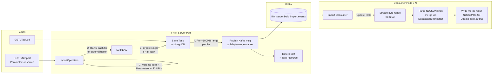
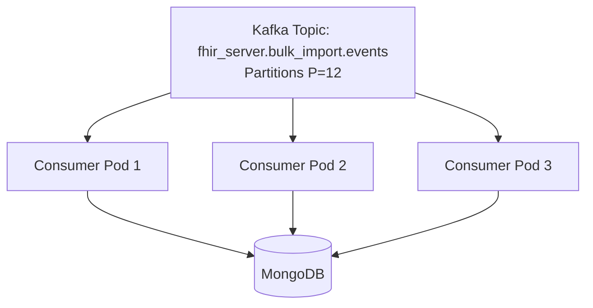
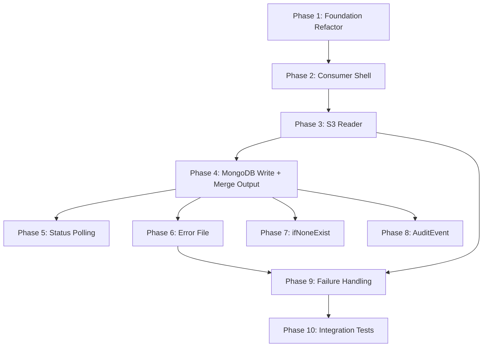

# $import Endpoint — Implementation Plan (v3: Server-Controlled Fan-Out)

**Ticket:** BAI-218 (Epic: BAI-206 Bulk FHIR Import via S3)
**Branch:** `BAI-218/fhir-import-endpoint`
**Design Doc:** [Technical Design: Bulk FHIR Import via S3](https://icanbwell.atlassian.net/wiki/spaces/ENTARCH/pages/6330613770)
**References:**
- [SMART on FHIR Bulk Import (Ping and Pull)](https://github.com/smart-on-fhir/bulk-import/blob/master/import-pnp.md)
- [HL7 Bulk Data Submit](https://build.fhir.org/ig/HL7/bulk-data/branches/argo25/en/submit.html)

---

## Architecture Summary



### Flow Summary

1. **Client** sends `POST /$import` with a FHIR Parameters resource containing S3 file URIs (up to 100 files, each 50MB–5GB)
2. **FHIR Server** validates the request, HEADs each S3 file for size validation, creates a **single FHIR Task** for the entire import, and publishes **one Kafka message per ~100MB byte-range marker** across all files
3. **Kafka consumers** (N replicas) pick up messages and process byte ranges in parallel
4. Each consumer streams its assigned byte range from S3 (the file is never split or copied), parses NDJSON, merges resources via `DatabaseBulkInserter`, and writes merge result NDJSON to S3
5. **Task.output** is updated with S3 paths to result and error files
6. **Client** polls status via standard `GET /Task/:id`

> **Parallelism model:** The server does a HEAD on each S3 file at POST time to get the file size, then publishes one Kafka message per ~100MB range (e.g. bytes 0–100MB, 100–200MB, etc.). Each consumer picks up a marker and streams just that byte range from S3. The file itself is never split or copied — it stays as-is on S3, consumers just read different windows of it. Source data is produced by Databricks, which handles partitioning at the pipeline level.

---

## 1. APIs

### 1.1 POST /$import — Trigger bulk import

```
POST /4_0_0/$import HTTP/1.1
Content-Type: application/fhir+json
Authorization: Bearer <token>
Prefer: respond-async
```

**Request Body (FHIR Parameters resource):**
```json
{
  "resourceType": "Parameters",
  "parameter": [
    {
      "name": "inputFormat",
      "valueString": "application/fhir+ndjson"
    },
    {
      "name": "input",
      "part": [
        { "name": "type", "valueString": "Patient" },
        { "name": "url", "valueUri": "s3://prod-fhir-bulk-import/run-20260521/Patient.ndjson" }
      ]
    },
    {
      "name": "input",
      "part": [
        { "name": "type", "valueString": "Condition" },
        { "name": "url", "valueUri": "s3://prod-fhir-bulk-import/run-20260521/Condition.ndjson" }
      ]
    },
    {
      "name": "input",
      "part": [
        { "name": "type", "valueString": "Observation" },
        { "name": "url", "valueUri": "s3://prod-fhir-bulk-import/run-20260521/Observation.ndjson" }
      ]
    }
  ]
}
```

| Parameter | Type | Cardinality | Description |
|-----------|------|-------------|-------------|
| `inputFormat` | valueString | 1..1 | Must be `application/fhir+ndjson` |
| `input` | part | 1..* | One per input file (max 100) |
| `input.type` | valueString | 0..1 | FHIR resource type contained in the file |
| `input.url` | valueUri | 1..1 | S3 URI (`s3://bucket/key`). Bucket must be in the allow-list. |

**Validation Rules:**
- Rejects patient-scoped tokens (403)
- `resourceType` must be `Parameters`
- `inputFormat` must be `application/fhir+ndjson`
- At least one `input` parameter required, up to 100
- Each `input.url` must be a valid S3 URI matching `s3://bucket/key`
- Each bucket must be in configured allow-list (`BULK_IMPORT_ALLOWED_S3_BUCKETS`)
- Each file must be between 50 MB and 5 GB (validated via S3 HEAD)
- Each NDJSON line must be under 16 MB

**Response — 202 Accepted:**
```json
{
  "resourceType": "Task",
  "id": "import-task-abc123",
  "status": "requested",
  "intent": "order",
  "code": {
    "coding": [
      {
        "system": "https://www.icanbwell.com/task-type",
        "code": "bulk-import"
      }
    ]
  },
  "authoredOn": "2026-06-22T14:30:00.000Z",
  "input": [
    {
      "type": { "text": "url" },
      "valueUri": "s3://prod-fhir-bulk-import/run-20260521/Patient.ndjson"
    },
    {
      "type": { "text": "url" },
      "valueUri": "s3://prod-fhir-bulk-import/run-20260521/Condition.ndjson"
    },
    {
      "type": { "text": "url" },
      "valueUri": "s3://prod-fhir-bulk-import/run-20260521/Observation.ndjson"
    }
  ]
}
```

**Error Responses:**
| Code | Condition |
|------|-----------|
| 400 | Invalid Parameters resource, missing/invalid inputs, invalid S3 URI, bucket not in allow-list, file size out of range |
| 401 | Missing or invalid Bearer token |
| 403 | Patient-scoped token |
| 500 | Internal server error (e.g. Kafka unavailable, MongoDB write failure) |

---

### 1.2 GET /Task/:id — Poll import status

Uses the **standard FHIR Task read endpoint** (no custom route needed). Consumers update the single Task resource as they process byte ranges.

```
GET /4_0_0/Task/{task-id} HTTP/1.1
Authorization: Bearer <token>
```

**Task Statuses:**
| Status | Meaning |
|--------|---------|
| `requested` | Task created, Kafka messages published, not yet picked up |
| `in-progress` | Consumers are actively processing byte ranges |
| `completed` | All files processed (check output for partial failures) |
| `failed` | Unrecoverable error (S3 not found, auth failure, etc.) |

**Completed Task example:**
```json
{
  "resourceType": "Task",
  "id": "import-task-abc123",
  "status": "completed",
  "intent": "order",
  "code": {
    "coding": [
      {
        "system": "https://www.icanbwell.com/task-type",
        "code": "bulk-import"
      }
    ]
  },
  "authoredOn": "2026-06-22T14:30:00.000Z",
  "input": [
    {
      "type": { "text": "url" },
      "valueUri": "s3://prod-fhir-bulk-import/run-20260521/Patient.ndjson"
    },
    {
      "type": { "text": "url" },
      "valueUri": "s3://prod-fhir-bulk-import/run-20260521/Condition.ndjson"
    }
  ],
  "output": [
    {
      "type": { "text": "result" },
      "valueUri": "s3://prod-fhir-bulk-import/run-20260521/output/Patient-001.ndjson"
    },
    {
      "type": { "text": "result" },
      "valueUri": "s3://prod-fhir-bulk-import/run-20260521/output/Patient-002.ndjson"
    },
    {
      "type": { "text": "result" },
      "valueUri": "s3://prod-fhir-bulk-import/run-20260521/output/Condition-001.ndjson"
    },
    {
      "type": { "text": "error" },
      "valueUri": "s3://prod-fhir-bulk-import/run-20260521/output/errors/Patient-errors.ndjson"
    }
  ]
}
```

Each input file may produce multiple output files (one per ~100MB byte-range). Output files contain merge result entries in NDJSON format (same format as `$merge` output):

```
{"created":true,"id":"patient-001","uuid":"849cb4f0-033b-5d6e-a614-9bbbbb3ba11e","resourceType":"Patient","updated":false,"sourceAssigningAuthority":"bwell"}
{"created":false,"id":"patient-002","uuid":"9575d139-6c60-52e4-83fb-f8534727fbab","resourceType":"Patient","updated":true,"sourceAssigningAuthority":"bwell"}
```

Error output files contain FHIR OperationOutcome resources in NDJSON format.

---

## 2. NDJSON File Formats

### 2.1 Input — one FHIR resource per line

```
{"resourceType":"Patient","id":"patient-001","identifier":[{"system":"https://www.icanbwell.com/person_id","value":"abc123"}],"name":[{"family":"Smith","given":["John"]}]}
{"resourceType":"Patient","id":"patient-002","identifier":[{"system":"https://www.icanbwell.com/person_id","value":"def456"}],"name":[{"family":"Johnson","given":["Sarah"]}]}
```

Each NDJSON line must be under 16 MB.

### 2.2 With ifNoneExist — duplicate prevention wrapper

```
{"ifNoneExist":"identifier=https://www.icanbwell.com/person_id|abc123","resource":{"resourceType":"Patient","id":"patient-001","identifier":[{"system":"https://www.icanbwell.com/person_id","value":"abc123"}],"name":[{"family":"Smith","given":["John"]}]}}
```

Detection: if a line's parsed JSON has an `ifNoneExist` key, treat it as a wrapper. Otherwise, treat the entire line as a FHIR resource.

### 2.3 Output — merge result NDJSON (written to S3)

Same format as `$merge` response. One line per resource processed:

```
{"created":true,"id":"patient-001","uuid":"849cb4f0-033b-5d6e-a614-9bbbbb3ba11e","resourceType":"Patient","updated":false,"sourceAssigningAuthority":"bwell"}
```

| Field | Description |
|-------|-------------|
| `created` | `true` if resource was newly created |
| `updated` | `true` if resource was updated (changed) |
| `id` | Resource ID |
| `uuid` | Internal UUID / global identifier |
| `resourceType` | FHIR resource type |
| `sourceAssigningAuthority` | Source authority code |
| `operationOutcome` | Present only on error — full OperationOutcome object |

### 2.4 Duplicate Handling

- **Within a single ~100MB processing batch:** Duplicate resources are rejected.
- **Across different batches:** Duplicates are processed normally via merge (idempotent if same data).
- **Concurrent duplicates:** Rejected after 3 retries. Errors are recorded as OperationOutcome entries in the error output file.

---

## 3. Kafka Event Schema

### 3.1 Import Byte-Range Event (FHIR Server → Consumer)

**Topic:** `fhir_server.bulk_import.events` (env: `KAFKA_BULK_IMPORT_EVENT_TOPIC`)

Published by `POST /$import` — one message per ~100MB byte-range marker per file.

```json
{
  "specversion": "1.0",
  "id": "<uuid>",
  "source": "https://www.icanbwell.com/fhir-server",
  "type": "ImportRangeRequested",
  "datacontenttype": "application/json",
  "data": {
    "taskId": "<Task.id>",
    "filepath": "s3://bucket/key/Patient.ndjson",
    "byteRangeStart": 0,
    "byteRangeEnd": 104857600,
    "rangeIndex": 0,
    "totalRanges": 5,
    "requestId": "<original-request-id>",
    "scope": "<jwt-scope>",
    "user": "<jwt-subject>"
  }
}
```

For a 500MB file, the server publishes 5 messages with byte ranges: 0–100MB, 100–200MB, 200–300MB, 300–400MB, 400–500MB. Each consumer picks up one marker and streams just that window from S3.

### 3.2 Import Status Events (for observability)

**Topic:** `fhir.bulk_import.status` (env: `KAFKA_BULK_IMPORT_STATUS_TOPIC`)
**Gated by:** `ENABLE_BULK_IMPORT_KAFKA_EVENTS`

```json
{
  "specversion": "1.0",
  "id": "<uuid>",
  "source": "https://www.icanbwell.com/fhir-server",
  "type": "ImportInitiated | ImportStatusUpdated | ImportCompleted",
  "datacontenttype": "application/json",
  "data": {
    "taskId": "<Task.id>",
    "filepath": "s3://bucket/key",
    "status": "requested | in-progress | completed | failed",
    "resourcesProcessed": 45000,
    "resourcesFailed": 20,
    "totalResources": 50000
  }
}
```

---

## 4. Detailed Workflow

### 4.1 POST /$import Flow (FHIR Server)

```
1. Validate auth (reject patient scopes)
2. Parse Parameters resource:
   a. Validate inputFormat = "application/fhir+ndjson"
   b. Extract input[] parameters (1–100 entries)
   c. Validate each input.url is valid S3 URI with allowed bucket
3. HEAD each S3 file:
   a. Get ContentLength
   b. Reject if < 50MB or > 5GB
4. Create single FHIR Task resource:
   - status: "requested"
   - intent: "order"
   - code: { coding: [{ system: "https://www.icanbwell.com/task-type", code: "bulk-import" }] }
   - input[]: one entry per file with type.text = "url", valueUri = S3 URI
   - meta.security: security tags from JWT scope
   - authoredOn: now
5. Save Task to MongoDB
6. For each file, calculate ~100MB byte-range markers:
   a. Ranges: [0, 100MB), [100MB, 200MB), ..., [lastStart, fileSize)
   b. Publish one Kafka message (ImportRangeRequested) per range
7. Queue AuditEvent
8. Return 202 with the Task resource
```

### 4.2 Consumer: Byte-Range Processing Flow

```
1. Receive Kafka message (ImportRangeRequested)
2. Load Task from MongoDB by taskId
3. Update Task status → "in-progress" (if not already)
4. Stream S3 object with Range header (byteRangeStart → byteRangeEnd)
5. Align to NDJSON line boundaries:
   - If byteRangeStart > 0: skip first partial line
   - Read one extra line past byteRangeEnd to complete the last line
6. For each NDJSON line:
   a. Reject if line > 16MB
   b. Parse JSON
   c. Detect ifNoneExist wrapper (extract resource + query)
   d. Run preSaveManager.preSaveAsync()
   e. Add to batch buffer
7. Every BATCH_SIZE resources:
   a. DatabaseBulkInserter.executeAsync() (merge semantics)
   b. Collect per-resource merge results and errors
   c. Handle duplicates within batch (reject), concurrent duplicates (retry 3x)
8. After all lines in range:
   a. Write merge result NDJSON to S3 (one output file per range)
   b. Write error OperationOutcome NDJSON to S3 (if any failures)
   c. Update Task.output with S3 paths to result and error files
9. If this is the last range to complete (all ranges done):
   a. Update Task status → "completed" or "failed"
   b. Publish ImportCompleted status event
```

---

## 5. FHIR Task Resource Mapping

We use the **standard R4 Task resource**. One Task per `$import` request (not per file).

| Field | Task Path | Notes |
|-------|-----------|-------|
| Import ID | `Task.id` | Generated UUID |
| Status | `Task.status` | requested, in-progress, completed, failed |
| Input files | `Task.input[]` | type.text = "url", valueUri = S3 URI (one per file) |
| Security | `Task.meta.security` | Security tags from JWT |
| Requester | `Task.requester` | Reference or display string |
| Request URL | `Task.instantiatesUri` | Original request URL |
| Timestamp | `Task.authoredOn` | When import was requested |
| Result files | `Task.output[]` | type.text = "result", valueUri = S3 path to merge result NDJSON |
| Error files | `Task.output[]` | type.text = "error", valueUri = S3 path to error NDJSON |
| Outcome | `Task.statusReason.text` | Human-readable outcome |

**Task.code** identifies this as a bulk-import task:
```json
{
  "code": {
    "coding": [
      {
        "system": "https://www.icanbwell.com/task-type",
        "code": "bulk-import"
      }
    ]
  }
}
```

---

## 6. Limitations

| Constraint | Value |
|------------|-------|
| Minimum file size | 50 MB |
| Maximum file size | 5 GB |
| Maximum NDJSON line size | 16 MB |
| Maximum files per request | 100 |
| Maximum total data per request | ~500 GB |
| Byte-range marker size | ~100 MB |

---

## 7. Consumer Deployment

### 7.1 New Service: `bulk-import-consumer`

A standalone Node.js process (separate from the FHIR server) that:
- Creates a Kafka consumer group (`fhir-bulk-import-consumer`)
- Subscribes to `fhir_server.bulk_import.events` topic
- Processes messages using the same IoC container as the FHIR server
- Scales horizontally (N replicas = N parallel byte-range processors)

**Entry point:** `src/operations/import/consumer/bulkImportConsumer.js`

```
Process startup:
1. Load environment config
2. Create IoC container (reuse createContainer.js)
3. Create KafkaClient
4. Create consumer (kafkaClient.createConsumerAsync({ groupId: 'fhir-bulk-import-consumer' }))
5. Subscribe to topics
6. Start message loop (kafkaClient.receiveMessagesAsync)
```

### 7.2 Scaling Model



- **Partition count** on the Kafka topic controls max parallelism
- Each consumer pod gets assigned partitions automatically by Kafka
- A 500MB file → 5 Kafka messages → up to 5 consumers process in parallel
- 100 files × average 5 ranges = ~500 Kafka messages → distributed across consumer pods

---

## 8. Configuration Properties (ConfigManager)

| Property | Env Var | Default | Description |
|----------|---------|---------|-------------|
| `enableBulkImport` | `ENABLE_BULK_IMPORT` | `false` | Feature gate for /$import endpoint |
| `bulkImportAllowedS3Buckets` | `BULK_IMPORT_ALLOWED_S3_BUCKETS` | `''` | Comma-separated bucket allow-list |
| `bulkImportBatchSize` | `BULK_IMPORT_BATCH_SIZE` | `100` | Resources per MongoDB write batch |
| `bulkImportRangeSizeMb` | `BULK_IMPORT_RANGE_SIZE_MB` | `100` | Byte-range marker size in MB |
| `bulkImportMinFileSizeMb` | `BULK_IMPORT_MIN_FILE_SIZE_MB` | `50` | Minimum file size in MB |
| `bulkImportMaxFileSizeGb` | `BULK_IMPORT_MAX_FILE_SIZE_GB` | `5` | Maximum file size in GB |
| `bulkImportMaxFilesPerRequest` | `BULK_IMPORT_MAX_FILES_PER_REQUEST` | `100` | Maximum input files per $import call |
| `bulkImportMaxLineSizeMb` | `BULK_IMPORT_MAX_LINE_SIZE_MB` | `16` | Maximum NDJSON line size in MB |
| `bulkImportDuplicateRetryAttempts` | `BULK_IMPORT_DUPLICATE_RETRY_ATTEMPTS` | `3` | Retries for concurrent duplicate writes |
| `kafkaBulkImportEventTopic` | `KAFKA_BULK_IMPORT_EVENT_TOPIC` | `fhir_server.bulk_import.events` | Kafka topic for byte-range import messages |
| `kafkaBulkImportStatusTopic` | `KAFKA_BULK_IMPORT_STATUS_TOPIC` | `fhir.bulk_import.status` | Kafka topic for observability events |
| `kafkaEnableImportEvents` | `ENABLE_BULK_IMPORT_KAFKA_EVENTS` | `false` | Publish observability events to status topic |
| `bulkImportConsumerGroupId` | `BULK_IMPORT_CONSUMER_GROUP_ID` | `fhir-bulk-import-consumer` | Kafka consumer group ID |
| `awsRegion` | `AWS_REGION` | `us-east-1` | AWS region for S3 |
| `bulkImportS3RetryAttempts` | `BULK_IMPORT_S3_RETRY_ATTEMPTS` | `3` | S3 read retry count |
| `bulkImportStalledTimeoutMinutes` | `BULK_IMPORT_STALLED_TIMEOUT_MINUTES` | `30` | Minutes before a Task is considered stalled |

---

## 9. Ordered Work Items

### Phase 1: Foundation Refactor (BAI-219) — Rework

Refactor the existing PR to switch from ImportStatus/K8s to Task/Kafka with FHIR Parameters input:

- [ ] Parse FHIR Parameters request body (extract inputFormat, input[].type, input[].url)
- [ ] Validate file count (1–100), S3 URIs, bucket allow-list
- [ ] HEAD each S3 file to validate size (50MB–5GB)
- [ ] Create single `Task` resource with all input files in `Task.input[]`
- [ ] Calculate ~100MB byte-range markers per file
- [ ] Create `BulkImportEventProducer` (publish ImportRangeRequested per byte-range marker)
- [ ] Return 202 with Task resource directly (not Bundle)
- [ ] Remove `ImportStatus` custom resource, `DatabaseImportManager`, K8s job wiring
- [ ] Remove `GET /$import-status/:id` route and `ImportByIdOperation`
- [ ] Update IoC wiring in `createContainer.js`
- [ ] Update route config (POST only)

### Phase 2: Kafka Consumer Shell (NEW)

**Order: After Phase 1. Establishes the consumer process.**

- [ ] Create `bulkImportConsumer.js` entry point
  - Load config, create container, create Kafka consumer, subscribe to topics
- [ ] Create `bulkImportConsumerRunner.js` message handler
  - Parse CloudEvent message (ImportRangeRequested)
  - Load Task from MongoDB
  - Update Task status → "in-progress"
  - Placeholder for byte-range processing (next phase)
  - Update Task status → "completed" / "failed"
- [ ] Add consumer group ID and topic configs to ConfigManager
- [ ] Add npm script or Dockerfile entry for running the consumer
- [ ] **Tests:** Consumer starts, receives message, updates Task status

### Phase 3: S3 NDJSON Reader (BAI-220)

**Order: After Phase 2. The reader is used by the consumer.**

- [ ] Add `BULK_IMPORT_ALLOWED_S3_BUCKETS` to ConfigManager
- [ ] Create `s3NdjsonReader.js`:
  - Use AWS SDK `GetObjectCommand` with `Range` header for byte-range reads
  - Align to NDJSON line boundaries (skip partial first line, read past end for last line)
  - Reject lines > 16MB
  - Pipe through `readline.createInterface()` for line-by-line processing
  - Yield parsed JSON objects via async iterator
  - Retry S3 `GetObject` on transient errors (configurable attempts)
- [ ] Wire into `BulkImportConsumerRunner`
- [ ] **Tests:**
  - Mock S3 stream, verify line-by-line parsing
  - Verify byte-range alignment to line boundaries
  - Verify lines > 16MB are rejected
  - Verify retry on S3 transient error
  - Verify error on missing file

### Phase 4: MongoDB Write Pacing + Merge Output (BAI-221)

**Order: After Phase 3. Combines the reader with the writer.**

- [ ] Add `BULK_IMPORT_BATCH_SIZE` to ConfigManager (default 100)
- [ ] In `BulkImportConsumerRunner`:
  - Read lines from `s3NdjsonReader`
  - Buffer into batches of `batchSize`
  - For each batch:
    - Run `preSaveManager.preSaveAsync()` on each resource
    - Use `DatabaseBulkInserter.executeAsync()` to write batch (merge semantics)
    - Handle duplicates within batch (reject)
    - Handle concurrent duplicates (retry up to 3x, then error)
    - Collect per-resource merge results (created/updated/error)
  - After all lines in range:
    - Write merge result NDJSON to S3 (same format as `$merge` output)
    - Write error OperationOutcome NDJSON to S3 (if any failures)
    - Update Task.output with S3 paths
  - If last range to complete: finalize Task status
- [ ] **Tests:**
  - Verify batch size is respected
  - Verify merge result NDJSON written to S3
  - Verify duplicate within batch rejected
  - Verify concurrent duplicate retried 3x then error
  - Verify partial failures don't stop the import
  - Verify Task transitions: requested → in-progress → completed
  - Verify last range completion finalizes Task

### Phase 5: Status Polling (BAI-222)

**Order: After Phase 4.**

Standard FHIR `GET /Task/:id` already works — no custom endpoint needed. Verify:

- [ ] Task.status reflects current processing state
- [ ] Task.output contains S3 paths to result and error files
- [ ] Task.statusReason has human-readable outcome
- [ ] **Tests:**
  - Read Task returns "requested" before consumer picks up
  - Read Task returns "in-progress" during processing
  - Read Task returns "completed" with output after finish
  - Read Task returns "failed" with statusReason on error

### Phase 6: OperationOutcome Error File (BAI-223)

**Order: After Phase 4. Needs per-resource errors from the write phase.**

- [ ] In `BulkImportConsumerRunner`:
  - For each failed resource, create an OperationOutcome NDJSON line
  - Buffer errors and write to S3 on completion
  - S3 path: `{original-path}/output/errors/{ResourceType}-errors.ndjson`
- [ ] Add error file URIs to `Task.output[]` with type.text = "error"
- [ ] **Tests:**
  - Verify error file written for failed resources
  - Verify OperationOutcome format with source line number
  - Verify no error file when zero failures

### Phase 7: ifNoneExist Support (BAI-225)

**Order: After Phase 4. Extends the line parser.**

- [ ] Detect wrapper format in consumer runner
- [ ] Before insert, run `ifNoneExist` query against MongoDB
- [ ] Track skipped-as-duplicate count in merge result output
- [ ] **Tests:**
  - Wrapper format parsed correctly
  - Duplicate prevention works
  - Mixed lines (some wrapped, some not) in same file

### Phase 8: AuditEvent Wiring (BAI-224)

**Order: After Phase 4.**

- [ ] AuditEvent on POST /$import trigger (already partially done)
- [ ] AuditEvent references Task resource ID
- [ ] **Tests:**
  - AuditEvent created on import trigger
  - AuditEvent references correct Task ID

### Phase 9: Failure Handling (BAI-226)

**Order: After Phases 3-4. Hardens all the above.**

- [ ] S3 read retries with exponential backoff
- [ ] Stalled Task detection (Task.meta.lastUpdated timeout)
- [ ] Invalid NDJSON handling (skip + error file)
- [ ] Consumer crash recovery (Kafka redelivers unacknowledged messages)
- [ ] Range failure handling (one range fails → record in error output, don't fail entire Task unless all ranges fail)
- [ ] **Tests:**
  - S3 transient error → retry succeeds
  - S3 permanent error → Task fails
  - Invalid JSON line → skipped, recorded in error file
  - Stalled Task detected after timeout

### Phase 10: Tests (BAI-227)

**Order: Last. Integration tests that exercise the full flow.**

- [ ] POST /$import → creates Task + publishes Kafka byte-range messages
- [ ] Consumer receives message → streams byte range → writes merge result NDJSON
- [ ] Multiple ranges per file → parallel processing → Task completed
- [ ] Partial failure → completed with error file
- [ ] Total failure → Task failed
- [ ] Multiple files → parallel processing across consumers
- [ ] Duplicate handling within and across batches

---

## 10. Dependency Order (Critical Path)



**Recommended order:**
Phase 1 → 2 → 3 → 4 → 6 → 7 → 5 → 8 → 9 → 10
