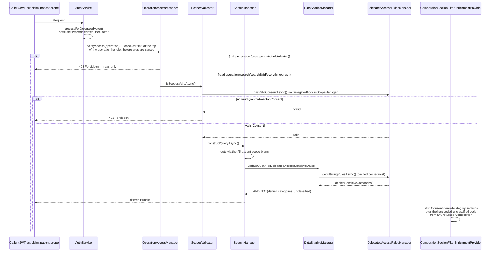

# Resource Authorization: How a Resource Gets Returned From a Query

This catalogs every distinct mechanism in this codebase that can affect whether a given FHIR
resource is included in the response to a search, read, `$everything`, `$graph`, or GraphQL
query. It is a map of *how*, in code, not a specification of *how it should behave* — for the
authoritative, living specification of intended behavior (including current known gaps and open
questions), see:

- [FHIR Server Security & Data Model Specification](https://icanbwell.atlassian.net/wiki/spaces/ENTARCH/pages/6582730753) (ENTARCH Confluence)
- [Plain-Language Companion](https://icanbwell.atlassian.net/wiki/spaces/ENTARCH/pages/6580764702) to the above

Before reviewing or modifying any code in this area, read `review.md` at the repo root — it's a
standing adversarial-review checklist for this exact surface (see `CLAUDE.md`).

## Quick index

Looking for one specific mechanism rather than reading start to finish? Jump straight to its
section:

| § | Mechanism | In one line |
|---|---|---|
| 1 | Access tags | Tenant-visibility filter ANDed onto every query |
| 2 | Owner tags | Single authoritative tenant; used in narrower single-resource/write checks |
| 3 | Scopes | `user`/`access`/`patient`/`admin` SMART scopes, validated before any query is built |
| 4 | Caller / account type | Service account, admin/tester, end-user, delegated actor, CMS partner |
| 5 | Patient-scoped tokens & link expansion | Identity-graph reachability replaces access-tag filtering |
| 6 | Consent | Four independent Consent-driven mechanisms (PROA/IAS, CMS, delegated, data-view-control) |
| 7 | Admin scope / wildcard bypass | `access/*` removes the tag filter; `admin/*` does not |
| 8 | Tag-based filters | `hidden` tag, connection-type tag |
| 9 | Sensitivity classification | Confidentiality-`R` tag, `unclassified` tag, delegated denylist |
| 10 | Delegated actor access | The full composed model: detection → consent gate → query routing → sensitive-data exclusion → section-level filtering |
| 11 | How these compose | The overall AND/OR rule tying §1–§10 together |
| 12 | Known gaps | Confirmed defects between intended and actual behavior |

## Mental model

A resource is returned to a caller only if it passes **every** gate below that applies to that
caller/request. Most gates are compiled into the MongoDB query itself (so a resource that fails
never leaves the database); a few are applied to already-fetched resources
(enrichment-time filtering). None of them are optional add-ons — a request that skips one because
it followed an unusual code path (a different traversal operation, a different resource type, a
raw id lookup) is a tenant-isolation bug, not a feature gap.

**Request flow:**

1. `FhirRouter` dispatches the request to an Operation class — e.g.
   `operations/search/searchBundle.js`, `searchStreaming.js`, `searchById/searchById.js`,
   `searchByVersionId/searchByVersionId.js`, `history/history.js`,
   `everything/everythingHelper.js`, `graph/graphHelpers.js`,
   `export/script/bulkDataExportRunner.js`, or GraphQL's `graphql/dataSource.js` (v1) /
   `graphqlv2/dataSource.js` (v2).
2. `ScopesValidator.verifyHasValidScopesAsync` runs the scope gate (§3) — before any query is
   built.
3. `SearchManager.constructQueryAsync` (`src/operations/search/searchManager.js`) is the central
   point where nearly all of the mechanisms below get ANDed onto the query.
4. The query flows through `queryRewriterManager` → `DataLayer` → MongoDB.

The write paths (`remove.js`, `update.js`, `patch.js`, `validate.js`) call that same
`constructQueryAsync` to locate their target resource before mutating it, so every gate below
applies there too — a caller can't find-and-modify a resource it couldn't have found via search.

### Gate composition diagram

Section numbers on each node match the numbered sections below. This is the same logic as §11,
drawn out as a decision path rather than a checklist.

```mermaid
flowchart TD
    Start(["Operation calls constructQueryAsync"]) --> Scope{"§3: scope valid for resourceType + operation?"}
    Scope -- no --> Deny403["403 Forbidden — query never built"]
    Scope -- yes --> Branch{"§5: patient/ scope AND resourceType is patient-filterable?"}

    Branch -- yes --> PatientFilter["§5: filter by Person/Patient identity-graph reachability"]
    PatientFilter --> ConfR["§9: AND exclude confidentiality-R tag (always, for every patient-scoped caller)"]
    ConfR --> Delegated{"§10: userType == delegatedUser?"}
    Delegated -- yes --> SensExcl["§10: AND exclude actor's denied sensitive categories + unclassified"]
    Delegated -- no --> Merge
    SensExcl --> Merge

    Branch -- no --> Wildcard{"§7: caller holds access/* wildcard scope?"}
    Wildcard -- yes --> NoTagFilter["No meta.security filter — every tenant's resources visible"]
    Wildcard -- no --> AccessTag["§1: AND filter by caller's authorized access tag(s)"]
    NoTagFilter --> Proa
    AccessTag --> Proa{"§6a: PROA/IAS data-sharing consent enabled?"}
    Proa -- yes --> ProaOr["OR a consent-driven branch (active, permit-type Consent)"]
    Proa -- no --> Merge
    ProaOr --> Merge

    Merge["§8: AND exclude hidden tag, unless _includeHidden=true"] --> CmsCheck{"§4/§6b: resourceType == Patient AND userType == cms-partner?"}
    CmsCheck -- yes --> CmsFilter["Restrict to consented patient uuids — fails closed if none"]
    CmsCheck -- no --> RunQuery
    CmsFilter --> RunQuery[("Run MongoDB query")]

    RunQuery --> PdvcCheck{"§6d: $everything/GraphQLv2 with a data-view-control Consent?"}
    PdvcCheck -- yes --> PdvcExcl["Exclude the patient-hidden resource reference(s)"]
    PdvcCheck -- no --> PersonCheck
    PdvcExcl --> PersonCheck{"§5: Person $everything?"}
    PersonCheck -- yes --> PersonNarrow["Narrow result set to only the requested Person id(s)"]
    PersonCheck -- no --> CompCheck
    PersonNarrow --> CompCheck{"§10: delegated actor and resource is a Composition?"}
    CompCheck -- yes --> SectionStrip["Strip Consent-denied-category sections, plus the hardcoded unclassified code (enrichment-time, not exclusion)"]
    CompCheck -- no --> Returned(["Resource returned"])
    SectionStrip --> Returned
```



---

## 1. Access tags (`meta.security`, system `.../access`)

The primary tenant-visibility control. One or more per resource; declares which tenant(s) may
read it. A resource with multiple access tags is visible to *any* tenant whose scope matches *at
least one* of them (shared-visibility, not exclusive-ownership).

```json
"meta": {
  "security": [
    { "system": "https://www.icanbwell.com/owner",  "code": "myhealth" },
    { "system": "https://www.icanbwell.com/access", "code": "myhealth" },
    { "system": "https://www.icanbwell.com/access", "code": "yourhealth" }
  ]
}
```

- `ScopesManager.getAccessCodesFromScopes` (`src/operations/security/scopesManager.js`) parses
  `access/<tag>.<read|write|*>` scopes into the caller's authorized access codes.
- `SecurityTagManager.getSecurityTagsFromScope` / `getQueryWithSecurityTags`
  (`src/operations/common/securityTagManager.js`) turns those codes into the actual Mongo filter
  ANDed onto every query — either a `meta.security` `$elemMatch` scan, or a denormalized
  `_access.<code>: 1` field lookup when an access index exists for that collection
  (`src/operations/common/accessIndexManager.js`, `src/indexes/indexProvider.js`).
- The `_security=https://www.icanbwell.com/access|<code>` search parameter goes through a
  separate but related path: `src/operations/query/filters/securityTag.js`
  (`FilterBySecurityTag`) — this is the caller *searching by* tag, which happens to reuse the same
  access-index field as the *authorization* filter above.

See `readme/security.md` §5.2 for the user-facing description.

## 2. Owner tags (`meta.security`, system `.../owner`)

Exactly one per resource; declares the single authoritative tenant. Unlike access tags, the owner
tag is **not** part of the bulk search-query filter — it's used in narrower checks:

- Single-resource checks like `ScopesManager.doesResourceHaveAnyAccessCodeFromThisList`
  (`scopesManager.js`) require the caller to match *both* an owner tag and an access tag.
- Consent lookups can additionally scope by owner tag (e.g. `CmsConsentManager.getConsentResources`
  takes an `ownerTags` filter, `src/operations/search/cmsConsentManager.js`).
- On write, `ScopesManager.isAccessTagChangeAllowedByScopes` /
  `ScopesValidator.isAccessTagChangeAllowedByAccessScopes` (`scopesValidator.js`) stop a caller
  from adding an access tag for a tenant it isn't itself authorized for.

## 3. Scopes (SMART on FHIR)

Four scope namespaces, all validated before any query is built:

| Scope | Form | Controls |
|---|---|---|
| `user` | `user/<resourceType\|*>.<read\|write\|*>` | which resource types the caller may read/write |
| `access` | `access/<tag\|*>.*` | which access-tagged resources the caller may see (§1) |
| `patient` | `patient/<resourceType\|*>.<read\|write>` | patient-scoped access via the identity graph (§5) |
| `admin` | `admin/*.*` | admin routes and debug/explain query params — **not** a tenant-filter bypass (see §7) |

- `ScopesManager` (`src/operations/security/scopesManager.js`): `parseScopes`,
  `getAccessCodesFromScopes`, `getUserScopes`, `getPatientScopes`, `getAdminScopes`,
  `hasPatientScope`.
- `ScopesValidator.verifyHasValidScopesAsync` (`src/operations/security/scopesValidator.js`), using
  `@asymmetrik/sof-scope-checker`, is called at the top of every read operation
  (`searchBundle.js`, `searchStreaming.js`, `searchById.js`, `history.js`, `everything.js`,
  `graph.js`, `summary.js`) before query construction — a request with an insufficient `user`
  scope for the resource type never reaches the query-building stage at all.
- **`AuditEvent`-specific pre-query gate** (not scope-based) —
  `SearchManager.validateAuditEventQueryParameters`, called from `searchBundle.js`,
  `searchById.js`, and `searchStreaming.js` before `constructQueryAsync` runs, rejects the whole
  request unless it supplies the resource type's required filters
  (`configManager.requiredFiltersForAuditEvent`, typically a `date` range bounded by
  `configManager.auditEventMaxRangePeriod`). This doesn't change *who* is allowed to see a
  resource — it's a query-shape/cost guard, not an access-control check — but it does determine
  whether any `AuditEvent` resources come back at all, so it belongs in this catalog.

See `readme/security.md` for the full walkthrough and multi-scope examples.

## 4. Caller / account type

The server doesn't just check scopes — *what kind of caller* holds them changes which of the
mechanisms below apply:

- **Service account** (OAuth client-credentials grant) and **admin/tester user account**
  (username+password grant) are authorization-equivalent: both get `user`/`access`/`admin` scopes
  and are filtered purely by §1–§3.
- **Person/Patient (end-user) auth** carries a `patient/` scope and is distinguished at the single
  line `const isUser = scopes.some(s => s.toLowerCase().startsWith('patient/'))`
  (`src/strategies/authService.js`). `isUser` is threaded onto `FhirRequestInfo` and changes which
  branch of `SearchManager.constructQueryAsync` builds the query — the patient-scope path (§5),
  not the tenant/access-tag path (§1) — for that request.
- **Delegated actor** (`userType: 'delegatedUser'`) — a `RelatedPerson`/similar acting on behalf of
  a Person via the JWT `act` claim. Composes the patient-scope (§5), consent (§6), and sensitivity
  (§9) mechanisms rather than being a separate code path; full model in §10.
- **CMS partner user** (`userType: 'cms-partner'`) — restricted to `Patient` search/`$everything`
  over GET only, with a `purposeOfUse` claim check, and further restricted to patients the partner
  has consent for (§6b). `src/utils/cmsManager.js` (`CMSManager.verifyAccess`).

`userType` is set in `AuthService.processUserInfo` (`authService.js`) from the JWT's `act` claim or
an allow-listed `user_type` claim.

## 5. Patient-scoped tokens, proxy-patient, and Person/Patient link expansion

When a caller holds a `patient/` scope (§3/§4) **and** the requested resource type is
patient-filterable (`ScopesManager.isAccessAllowedByPatientScopes` checks both), access is **not**
decided by access tags at all — it's decided by reachability through that caller's own
Person/Patient identity graph. This is a separate, mutually exclusive branch from §1 in
`SearchManager.constructQueryAsync`: a patient-scoped caller requesting a non-patient-filterable
resource type falls through to the §1 access-tag branch instead for that request.

- `PatientScopeManager.getPatientIdsFromScopeAsync` (`src/operations/security/patientScopeManager.js`)
  resolves the JWT's person id into the proxy-patient id (`person.<uuid>`) plus every linked
  `Patient` id, via `PersonToPatientIdsExpander.getPatientIdsFromPersonAsync`
  (`src/utils/personToPatientIdsExpander.js`) — the code that walks `Person.link`. Traversal is
  capped at a recursion depth of 4 (`maximumRecursionDepth` in that file); hitting the cap logs a
  warning and returns whatever was resolved so far rather than erroring.
- `PatientQueryCreator.getQueryWithPatientFilter` (`src/operations/common/patientQueryCreator.js`)
  turns the resolved id set into the actual Mongo restriction, using the per-resource-type
  reference path in `patientFilterManager.js` (`patientFilterMapping`).
- The **proxy-patient** convention (`Patient/person.<uuid>` in a search parameter, e.g.
  `?subject=Patient/person.<id>`) is expanded the same way by
  `PatientProxyQueryRewriter.rewriteArgsAsync` (`src/queryRewriters/rewriters/patientProxyQueryRewriter.js`).
  See `readme/proxyPatient.md`.
- `$everything` (`everything/everythingHelper.js`) and `$graph` (`graph/graphHelpers.js`) both
  re-invoke `SearchManager.constructQueryAsync` at **every traversal hop**, so a resource reached
  via link-following gets the same filter a direct search would apply — not a weaker one. Both
  GraphQL APIs (`src/graphql/dataSource.js` and `src/graphqlv2/dataSource.js`) funnel through the
  same `searchBundleAsync` path rather than an independent query builder.
- **Person `$everything`** narrows the *result set* (not the underlying access check) to only the
  explicitly-requested Person id(s) — a sibling Person sharing the same underlying Patient is
  resolved internally but excluded from the response. See `readme/personEverything.md`.

## 6. Consent

There is no single "consent system" — four independent mechanisms use `Consent` resources to gate
or expand what's returned, each with its own category code and its own code path:

**a. PROA/IAS data-sharing consent** — gated by `ConfigManager.enableConsentedProaDataAccess`
(env `ENABLE_CONSENTED_PROA_DATA_ACCESS`). `DataSharingManager.updateQueryConsideringDataSharing`
(`src/operations/search/dataSharingManager.js`) uses `ProaConsentManager.getConsentResources`
(`src/operations/search/proaConsentManager.js`) to find active, `permit`-type Consents and OR's a
connection-type-filtered query branch onto the search.

**b. CMS partner data-sharing consent** — for `userType: 'cms-partner'` callers only (§4).
`DataSharingManager.updateQueryConsideringCmsDataSharing` uses
`CmsConsentManager.getPatientIdsWithConsent` (`src/operations/search/cmsConsentManager.js`) to
restrict `Patient` search to consented patient uuids; fails closed (matches nothing) if no consent
is found.

**c. Delegated-actor consent** — for `userType: 'delegatedUser'` callers (§4); ties a grantor
Person's Consent to the grantee actor and drives a sensitivity-based (§9) denylist layered on top
of the §5 patient-scope query. Full model, including the read-only operation restriction: §10.

**d. Patient Data View Control consent** — lets a patient exclude specific resources from their
own `$everything`/GraphQLv2 result via a `dataConnectionViewControl`-category Consent referencing
the resource(s) to hide. `src/utils/patientDataViewController.js`
(`PatientDataViewControlManager.getConsentAsync`), gated by
`configManager.clientsWithDataConnectionViewControl`. Full detail:
`readme/patientDataViewControl.md`.

## 7. Admin scope and the wildcard bypass

There is no dedicated "admin bypass" for tenant filtering. What actually removes the §1 filter is
the **wildcard access code**, granted by a scope like `access/*.read` or `access/*.*`: when
`ScopesManager.getAccessCodesFromScopes` returns `['*']`,
`SecurityTagManager.getSecurityTagsFromScope` returns an empty tag list, which means *no*
`meta.security` filter is ANDed onto the query at all — every tenant's resources become visible.

The literal `admin/` scope namespace is a **different, narrower** mechanism
(`ScopesManager.getAdminScopes`, `ScopesValidator.isAdminScope`): it gates admin-panel routes and
unlocks debug/explain query parameters (`_explain`, `_debug`, `_setIndexHint`). Holding `admin/*.*`
does not, by itself, bypass access-tag filtering — that only happens if the caller *also* has the
`access/*` wildcard.

## 8. Tag-based filters independent of the tenant/consent model

These apply regardless of scope type, on top of everything above:

- **`hidden` tag** (`meta.tag`, system `.../CodeSystem/server-behavior`, code `hidden`) — excluded
  from every search by default (`src/operations/query/r4.js`), unless the caller passes
  `_includeHidden=true`. Does not apply to by-id lookups, history, `DELETE`, or `AuditEvent`.
- **Connection-type tag** (`.../connectionType`) — used by
  `DataSharingManager.getConnectionTypeFilteredQuery` to restrict the PROA/IAS consent-driven query
  branch (§6a) to an allow-listed set of connection types.

The other two `meta.security` tags that gate access independent of tenant/consent — the
confidentiality restriction tag and the `unclassified` sensitivity tag — classify a resource by
*what it's about* rather than controlling visibility or search behavior, so they're covered
together with the rest of the sensitivity model in §9.

## 9. Sensitivity classification

Orthogonal to tenant visibility (§1) and consent-driven expansion (§6): these mechanisms gate
access based on how sensitive a resource's *content* is, not who owns it or what's been consented
to. A resource can be tenant-visible and consent-permitted and still be excluded solely on
sensitivity grounds.

- **Confidentiality restriction tag** (`meta.security`, system
  `http://terminology.hl7.org/CodeSystem/v3-Confidentiality`, code `R`; `RESOURCE_RESTRICTION_TAG`
  in `src/constants.js`) — excluded unconditionally for every patient-scoped (`isUser`) caller,
  regardless of what the patient-scope identity graph (§5) would otherwise allow. Applied at
  query-build time by `PatientQueryCreator.applyCommonPatientFilters`
  (`src/operations/common/patientQueryCreator.js`), which both branches of the §5 patient-scope
  path route through, and enforced again on write by
  `ScopesValidator.isAccessToResourceRestrictedForPatientScope` (`scopesValidator.js`) so a
  patient-scoped caller can't write around the same restriction.
- **`unclassified` sensitivity tag** (`meta.security`, system `.../sensitivity-category`, code
  `unclassified`; `SENSITIVE_CATEGORY` in `src/constants.js`) — auto-added on write by
  `unclassifiedSensitivityTagHandler` (`src/preSaveHandlers/handlers/unclassifiedSensitivityTagHandler.js`)
  for resource types listed in `configManager.resourceTypesForUnclassifiedTagging` (env
  `UNCLASSIFIED_TAGGING_RESOURCES`); a writer can suppress the auto-tag with the
  `x-suppress-unclassified-tag` header (`PreSaveOptions.suppressUnclassifiedTag`). On read, it is
  hardcoded into the delegated-actor exclusion list (§10) regardless of what that actor's Consent
  otherwise permits — no Consent can override it. See `readme/unclassifiedDataTagging.md`.
- **Denied sensitive-category list** — not a fixed tag but a per-caller, Consent-derived denylist
  of `sensitivity-category` codes. Built only for delegated actors, from their grantor's Consent
  `deny` provisions; this is the mechanism, not a tag on the resource itself. Full detail: §10.

## 10. Delegated actor access

A delegated actor (`userType: 'delegatedUser'`, §4) is a `RelatedPerson`-like caller acting on
behalf of a Person: authenticated with a `patient/` scope for that Person, plus a JWT `act` claim
identifying the actor. Nothing here is a separate code path — it's several of the mechanisms above
composed together:



1. **Detection** — gated by `configManager.enableDelegatedAccessDetection`. If the JWT carries an
   `act` claim, `AuthService.processForDelegatedActor` (`src/strategies/authService.js`) sets
   `userType: delegatedUser` and `actor` on the request context; `entitlements`, if present, become
   `purposeOfUse`.
2. **Operation restriction** — checked before anything else below: `OperationAccessManager` →
   `DelegatedAccessManager.verifyAccess` (`src/utils/delegatedAccessManager.js`) runs at the top of
   the operation handler in `fhirOperationsManager.js`, before request args are even parsed. It
   allows only `search`, `searchById`, `everything`, and `graph`; any write operation is rejected
   with `ForbiddenError` immediately — the consent/query logic below never runs for a write.
3. **Pre-query consent gate** (alongside the §3 scope check) — `ScopesValidator.isScopesValidAsync`
   calls `DelegatedAccessScopeManager.isAccessAllowedAsync` →
   `DelegatedAccessRulesManager.hasValidConsentAsync`. No active Consent tying the grantor Person
   to the actor → `ForbiddenError` before any query is built.
4. **Query path** — because the actor holds a `patient/` scope, `SearchManager.constructQueryAsync`
   routes the request through the ordinary patient-scope/identity-graph branch (§5), **not** the
   access-tag branch (§1); reachability is decided exactly as it would be for the grantor Person.
5. **Sensitive-data exclusion (bolt-on, delegated-only)** — for resource types the patient-scope
   machinery can filter (`PatientFilterManager.canAccessResourceWithPatientScope`),
   `SearchManager.constructQueryAsync` additionally calls
   `DataSharingManager.updateQueryForDelegatedAccessSensitiveData`
   (`src/operations/search/dataSharingManager.js`), which:
   - looks up the grantor→actor Consent via `DelegatedAccessRulesManager.getFilteringRulesAsync`
     (cached on the request-scoped `actor` object, so it's fetched once per request);
   - returns an impossible query (`_uuid: '__invalid__'`) if no active Consent is found, and throws
     `ForbiddenError` if more than one is found — ambiguous permissions fail closed rather than
     guessing;
   - otherwise parses `consent.provision.provision[]` entries with `type: 'deny'` and a
     `sensitivity-category` `securityLabel` into a denied-code list, and ANDs a
     `meta.security` `$not`/`$elemMatch` exclusion for those codes **plus** the hardcoded
     `unclassified` code (§9) onto the query.
6. **Content-level filtering (enrichment-time — not a resource inclusion/exclusion decision)** —
   `CompositionSectionFilterEnrichmentProvider`
   (`src/enrich/providers/compositionSectionFilterEnrichmentProvider.js`) reuses the actor's
   Consent-derived denied-category set (same lookup as step 5, read from the cached
   `actor._filteringRules`) to strip individual `section`s (recursively, including into
   `contained` resources) out of an already-*returned* `Composition`. Like step 5's query-level
   exclusion, this **also** folds in the hardcoded `unclassified` code — `getDeniedSensitiveCategorySet`
   adds it to the denylist it builds before stripping, so a `Composition` section tagged
   `unclassified` is stripped here too, not only sections matching a code the grantor's Consent
   explicitly denied. The Composition itself still passed every gate above; only some of its
   sections are removed. This is the one mechanism in this document that shapes resource
   *content* rather than deciding whether the resource is returned at all.

Full detail: `readme/delegatedActorAccess.md`.

## 11. How these compose

For a given caller and resource, the resource is returned only if **all** of the following hold:

1. The caller's `user`/`patient` scope permits the resource type and operation (§3).
2. Either: the caller holds the wildcard access code (§7), **or** the resource carries an access
   tag the caller is authorized for (§1), **or** the caller is patient-scoped and the resource is
   reachable through that caller's own identity graph (§5).
3. The resource is not `hidden`-tagged, unless explicitly requested (§8).
4. If the caller is patient-scoped, the resource is not confidentiality-`R`-restricted (§9).
5. If the caller is a delegated actor or CMS partner, the resource passes that caller type's
   consent-driven filter and is not `unclassified` for delegated actors (§6b, §9, §10).
6. If the requesting client relies on consent-based data-sharing expansion (§6a) or the patient
   has an active data-view-control exclusion (§6d), those results are included/excluded
   accordingly.

Any code path that reaches the database without going through `SearchManager.constructQueryAsync`
— or that fetches by raw id/uuid and defers the access check to after the fetch — is a
red flag under `review.md`'s checklist, since `_uuid`/`id` are deterministic and not secret
(`src/utils/uid.util.js`, see `readme/security.md` §5.3.1).

## 12. Known gaps in the current implementation

Findings from an adversarial review of this surface against `review.md`'s checklist, verified
directly against source (not assumed from the checklist, and not taken on faith from a single
pass). These are gaps between what the sections above document as the *intended* composition and
what the code actually enforces — thirteen have since been fixed, none remain open, and three
suspected findings were investigated and do not reproduce (kept here, marked as such, so they
aren't re-discovered and re-reported from scratch later).

### Fixed

- **FIXED — a patient-scoped write to an EXISTING resource could set an arbitrary access tag
  (§1, §4).** `ScopesManager.isAccessTagChangeAllowedByScopes`
  (`src/operations/security/scopesManager.js`) used to return `true` immediately once the caller
  held a `patient/` scope for the resource type, without comparing old vs. new `meta.security`
  access-code values at all. The only other write-path check,
  `PatientScopeManager.canWriteResourceAsync` (`src/operations/security/patientScopeManager.js:277`),
  validates that the resource's `patient`/`subject` reference belongs to the caller but never
  inspects `meta.security`. A patient-scoped caller could therefore update a resource that
  legitimately belonged to their own patient while stamping it with an arbitrary tenant's access
  tag, granting (or revoking) that tenant's visibility with no authorization from the tenant
  itself.

  The fix adds an `isCreate` parameter (`ScopesValidator.isAccessTagChangeAllowedByAccessScopes`
  passes `isCreate: !currentResource`): the patient-scope bypass now applies **only on create**. A
  patient-facing app has no `access/` scope on its token to validate a brand-new resource's
  self-assigned owner/access tags against — there's no other mechanism in this codebase for it to
  declare its own tenant identity on create (confirmed empirically against
  `src/tests/patientScope/create_with_patient_scope/create_with_patient_scope.test.js`, whose real
  fixture creates a `Condition` under a bare `patient/Condition.write` scope carrying its own
  `owner`/`access` tags, no `access/` scope at all). A write against an **existing** resource
  always goes through the real old-vs-new comparison, regardless of caller type, closing the
  actual vulnerability (silently granting/revoking a tenant's visibility on data that already
  existed).

  `isAccessToResourceAllowedBySecurityTags` is deliberately **left unchanged** — an earlier version
  of this fix modified it the same way (bypass only when the resource carries no tags at all), but
  that also breaks the `create_with_patient_scope` flow (it's called, unconditionally, before the
  tag-change check on every write). More fundamentally, its patient-scope bypass isn't the same bug:
  this method's job for a patient-scoped caller was never tenant isolation by tag — that's
  `PatientScopeManager.canWriteResourceAsync` (Person/Patient-id ownership matching), which every
  real write path ANDs in via `ScopesValidator.isAccessToResourceAllowedByAccessAndPatientScopes`.
  This was tried once already, for real: commit `8542592a5` (DCON-4806) added a tag-match
  requirement here and was reverted in `a5ded4a4a` because it broke legitimate patient-scoped
  writes — re-adding it repeats that regression. (Tests that assert this method alone should
  enforce tenant isolation, in isolation from the ANDed ownership check, produce a false positive;
  see the pure-`patient/`-scope FIXED finding further below and the note on
  `merge.crossTenant.test.js`/`mergeCrossTenantWrite.test.js` for the same failure shape elsewhere.)
- **FIXED — `$access-history` link traversal dropped the access-tag check past the first hop (§5).**
  `PersonToPatientIdsExpander.getPatientIdsFromPersonAsync`
  (`src/utils/personToPatientIdsExpander.js`) applies the caller's access-tag filter only when
  resolving the top-level Person id (the `addTopPersonAccessCheck` flag); its own recursive calls
  used to pass `requestInfo` through but omit `addTopPersonAccessCheck`, so it silently defaulted
  back to `false` at every deeper level. A tenant/service-account caller holding a valid access tag
  on the top-level Person could reach a `Person.link`-connected Patient belonging to a different
  tenant with no re-check, leaking access-history metadata cross-tenant via `accessHistory.js`. The
  fix forwards `addTopPersonAccessCheck` through both recursive call sites, so the check now applies
  at every recursion level, consistent with how the sibling `$everything`-scope-check condition on
  the same line already behaved (it doesn't depend on recursion-level state, so it was already
  reapplied at every hop).
- **FIXED — ordinary search and GraphQL v2 never requested the §5 access-tag re-check on `Person.link`
  traversal at all, for a tenant/service-account caller (§1, §5).** The previous fix (immediately
  above) only closed the gap for callers of `PersonToPatientIdsExpander` that already passed
  `addTopPersonAccessCheck: true` (`accessHistory.js`). `PatientScopeManager.getPatientIdsByPersonIdAsync`
  — the path used by ordinary search (`SearchManager.constructQueryAsync`,
  `src/operations/search/searchManager.js`) and GraphQL v2 (`src/graphqlv2/dataSource.js`) — never
  requested the check at all, at any level, so a tenant/service-account caller whose own Person had a
  stray `Person.link` into another tenant's Person/Patient (data corruption, matching error, or
  intentional manipulation) could reach that tenant's data through plain search or GraphQL v2 with no
  re-check anywhere in the traversal. Fixed by threading `requestInfo`/`addTopPersonAccessCheck` from
  `PatientScopeManager` into the expander for both call sites, plus `canWriteResourceAsync`
  (`src/operations/security/patientScopeManager.js`). An earlier version of this fix added a
  same-owner-tag fallback for pure-`patient/`-scope callers (see the pure-`patient/`-scope FIXED
  finding further below); that fallback was reverted (`e5b649607`) because bwell's master-Person →
  client-Person linking is *intentionally*
  cross-tenant (`Person.link` connecting a Main Person owned by one tenant to Client Person records
  owned by others is the legitimate identity-matching model, not a leak), confirmed against the
  real, currently-passing `src/tests/patientScope/search_with_duplicate_patient_id.person_scope_uuid`
  fixture. Covered by `src/tests/unit/utils/personToPatientIdsExpander.crossTenant.test.js`.
- **FIXED — a caller could add a `Person.link` into a tenant they cannot access, then reach that
  tenant's data via link traversal (§1, §2, §4).** `ResourceValidator.validatePatientReference`
  (`src/operations/common/resourceValidator.js`) skips patient-reference validation entirely for
  non-`user`-scoped (access-scoped/service-account) callers on array-reference fields — intentional
  for most such fields (ingestion pipelines need to freely maintain them) — but this applied to
  `Person.link` too, so a caller holding only an access tag for its own tenant could link a Person it
  owns into another tenant's Person/Patient with no ownership check on the *target* at all, letting
  every mechanism in §5 (which treats a link as fully authoritative once reached) traverse straight
  into that tenant's data. The bug also had a create-path variant (the check only ran when diffing
  against a `currentResource`, so a brand-new Person created with the cross-tenant link already
  inlined skipped it entirely) and a response-code side channel (an early version of the fix let a
  403-vs-404 distinction leak whether the target existed in another tenant, an existence-oracle
  pattern flagged elsewhere in this doc — see the closing paragraph of §11). Fixed by
  `validateNewPersonLinkTargetsBelongToCallersTenant` (`resourceValidator.js:132`), called for every
  `Person.link` addition on create, update, and merge: it resolves each new link target and rejects
  with a uniform not-found error (`resourceValidator.js:181`) if the reference can't be resolved at
  all, a forbidden-shaped rejection (`resourceValidator.js:197`) only if a match exists but none are
  accessible to the caller, and an ambiguous-match rejection (`resourceValidator.js:209`) if more than
  one accessible resource shares a bare id — fail-closed on ambiguity rather than guessing. Covered by
  `src/tests/merge/merge_person_link_cross_tenant/merge_person_link_cross_tenant.test.js` and
  `src/tests/unit/operations/common/resourceValidator.test.js`. Deliberately scoped to `Person.link`
  only, not a blanket fix for every array-reference field on a non-`user` scope — see the tripwire
  comment left in `resourceValidator.test.js` guarding against that distinction being lost later.

  **Residual, not fully closed:** only the *HTTP status code* side channel was closed — both
  outcomes are wrapped in `NotValidatedError`, whose constructor (`httpErrors.js:97`) hardcodes
  `statusCode: 400` regardless of which branch produced the `OperationOutcome`, so there is no
  longer a 403-vs-404 distinction. The *response body* still leaks the same information:
  `resourceValidator.js:178` returns `issue.code: 'not-found'` when zero matches exist anywhere,
  vs. `resourceValidator.js:194`'s `issue.code: 'forbidden'` when a match exists but is
  inaccessible — the same existence-oracle pattern §11's closing paragraph warns about, just moved
  from the status code into the body. Closing this fully would mean returning an identical body
  (not just an identical status code) for both outcomes.
- **FIXED — CMS-partner/delegated-user resource-type allowlist was enforced on REST but not on
  GraphQL, on two separate code paths (§4, §11).** REST search gates CMS-partner and delegated-user
  callers through `OperationAccessManager.verifyAccess`, but neither GraphQL v1's root resolvers
  (`getResources`/`getResourcesBundle`, `src/graphql/dataSource.js`) nor v2's equivalents
  (`src/graphqlv2/dataSource.js`) called it — a CMS-partner token allowlisted to `Patient`-only could
  read any resource type (e.g. `Practitioner`) over GraphQL. A second, independent bypass survived
  even after gating just those root entry points: every reference-typed field
  (`Patient.generalPractitioner`, `Observation.subject`, etc.) resolves through the shared
  `getResourcesInBatch` DataLoader, which called `searchBundleAsync` directly — so a caller
  allowlisted to `Patient` only could still reach `Practitioner` via
  `{ Patient(id:"p1") { generalPractitioner { id } } }`. Fixed by adding
  `OperationAccessManager.verifyGraphQLReadAccess` (`src/utils/operationAccessManager.js:43`) and
  calling it from all three GraphQL entry points in both API versions
  (`src/graphql/dataSource.js:182,409,507`; `src/graphqlv2/dataSource.js:225,485,539`). Covered by
  `src/tests/unit/graphql/dataSource.test.js`, `src/tests/unit/graphqlv2/dataSource.test.js`, and
  `src/tests/unit/utils/operationAccessManager.test.js`.
- **FIXED — `DataSharingManager`'s per-request `allowedPatientIds` cache ignored `securityTags`,
  letting one tenant's PROA consent result leak into a later query for a different tenant within the
  same `$everything` request (§6a, review.md §D).** `getDataSharingManagerCache`
  (`src/operations/search/dataSharingManager.js:113`) keyed its cache purely on `requestId` (plus
  chunk index); a `$everything` request that queries multiple resource types with different
  effective `securityTags` per call (e.g. one tenant's data-sharing scope for one type, another's for
  the next) reused the first call's `allowedPatientIds`/`patientIdToImmediatePersonUuid` for every
  subsequent call regardless of `securityTags` — a "no restriction" vs. "no matches" failure shape
  the same class review.md §D warns about generally. Fixed by folding a sorted `securityTags` suffix
  into the cache-map name (`dataSharingManager.js:115-116`), so different tags get an independent
  cache entry and a fresh consent check. Covered by
  `src/tests/unit/operations/search/proaConsentVulnerabilities.test.js` (Vulnerability 3).
- **FIXED — Consent `provision.period` expiry was never checked in the PROA/CMS data-sharing consent
  queries (§6a, §6b).** `ProaConsentManager.getConsentResources`
  (`src/operations/search/proaConsentManager.js`) and `CmsConsentManager.getConsentResources`
  (`src/operations/search/cmsConsentManager.js`) only checked `status: 'active'` and
  `provision.type: 'permit'` — never `provision.period.start`/`.end`. A Consent whose grant window
  had lapsed but whose `status` was never flipped to `inactive`/`rejected` kept widening the query and
  granting PHI access indefinitely past the authorized consent period. Fixed by adding symmetric
  period-bound clauses (absent-or-in-range) to both managers' queries
  (`proaConsentManager.js:61-76`, `cmsConsentManager.js:52-66`), matching the convention already used
  in `delegatedAccessRulesManager.js`. Covered by `proaConsentManager.test.js`/`cmsConsentManager.test.js`
  and `proaConsentVulnerabilities.test.js` (Vulnerabilities 1 & 2).
- **FIXED — no cache-invalidation trigger existed for the `$everything` cache on a `Consent` write, so
  stale PHI could be served for up to the Redis TTL (~600s) after consent was revoked (§6, §9,
  review.md §D).** `PatientEverythingCacheKeyGenerator` had no working `getGenerationForId`, so its
  cache key never changed when a Consent was created, updated, or removed; invalidation only happened
  via the manual `/admin/invalidateCache` endpoint. Fixed by a new post-save handler,
  `ConsentCacheInvalidationHandler`
  (`src/dataLayer/postSaveHandlers/handlers/consentCacheInvalidationHandler.js`), registered for
  every write path, which bumps a `Patient:<uuid>:Everything:Generation` Redis counter on any
  `Consent` write and now also best-effort bumps the counter for the immediate client Person(s) *and*
  the bwell master Person at the top of the link graph (via `BwellPersonFinder`) — closing a
  follow-up gap where a master-Person-keyed proxy `$everything` cache kept serving pre-revocation PHI
  even after the first cut of this fix bumped only the immediate client Person. Covered by
  `consentCacheInvalidationHandler.test.js` and `proaConsentVulnerabilities.test.js`
  (Vulnerabilities 4 & 5).
- **FIXED — the ClickHouse-backed Group member roster (used by `Group/[id]/$export`) had no
  fail-closed tenant check, a mechanism §1/§2 don't otherwise cover since it isn't a Mongo
  `meta.security` query (§1, §2).** `getCurrentMembersWithCountAsync`/`getActiveMembersPageAsync`/
  `getActiveMemberCountAsync` (`src/dataLayer/providers/mongoWithClickHouseStorageProvider.js:139,190,228`)
  is the roster path `bulkDataExportRunner.js` uses for a Group export; a caller whose request
  produced no resolvable access/owner tags (malformed scope, an upstream bug) got an unrestricted
  ClickHouse roster query — another tenant's Group members — instead of an error. Fixed by
  `_assertTenantScope` (`mongoWithClickHouseStorageProvider.js:82`), which throws `ForbiddenError`
  before any ClickHouse query runs unless the caller has an access tag, an owner tag, or full access,
  and `_normalizeTenantContext` (`:61`), which treats a malformed/omitted `securityContext` as
  empty-restricted rather than unrestricted. Covered by
  `mongoWithClickHouseStorageProvider.test.js` and `src/tests/group/group_clickhouse_id_and_tenant.test.js`.
- **FIXED — `ExportStatus` read denial used `ForbiddenError` (403), letting the response distinguish
  "exists, not mine" from "doesn't exist" — the existence-oracle pattern §11's closing paragraph warns
  about generally (§1, §11).** `exportById.js` now throws `NotFoundError` (not `ForbiddenError`) on
  denial (`src/operations/export/exportById.js:73,86`), and gates access with
  `ScopesManager.isAccessToResourceAllowedByAccessTagOnly` (`:80`) rather than an owner+access check —
  `ExportStatus` is always created under a hardcoded platform-level owner tag regardless of the
  triggering tenant, so an owner+access check had also been incorrectly rejecting legitimate tenants
  polling their own export status. Covered by `src/tests/unit/operations/export/exportById.crossTenant.test.js`.
- **FIXED — link traversal never checked `Person.link.assurance`, which was also the root cause of a
  pure-`patient/`-scope caller getting no re-check at all on cross-tenant `Person.link` traversal (§1,
  §5).** These were the same underlying gap surfacing at two layers, not two separate bugs: the
  `addTopPersonAccessCheck` re-check added by the two FIXED findings above operates on the
  scope-derived query filter, which is a complete no-op for a caller with no `access/` scope at all
  (`SecurityTagManager.getSecurityTagsFromScope` legitimately returns `[]` for a pure `patient/` scope) —
  so that caller type had no re-check to bind to, regardless of what a linked Person's `assurance`
  said. A same-owner-tag fallback was tried and reverted (`e5b649607`) because it produced
  false-positive denials for the legitimate cross-tenant master-Person → client-Person linking model,
  and an unrelated tag-match requirement had already been tried and reverted once before that
  (`8542592a5`/`a5ded4a4a`) for the same reason on the write path. Fixed by gating the *decision to
  follow a `Person.link` at all* on its `assurance` value, inside the traversal loop itself,
  independent of caller scope type — which protects a pure-`patient/`-scope caller exactly as much as
  a tenant/service-account caller, because the check runs before any scope-derived query is built.

  New helper `src/utils/personLinkAssuranceLevel.js` (`rankPersonLinkAssurance`/`meetsMinimumAssurance`)
  ranks FHIR R4's `identity-assuranceLevel` codes `level1`–`level4` as 1–4, with any missing/unrecognized
  value ranking `0` (never treated as trusted). Shipped as two separate, sequential commits inside
  `PersonToPatientIdsExpander.getPatientIdsFromPersonAsync`
  (`src/utils/personToPatientIdsExpander.js:341-368,371-384`), given real `Person.link.assurance`
  population has never been measured and two related heuristics were already reverted for breaking
  legitimate traffic: **(a)** dry-run logging, gated by `configManager.logPersonLinkAssuranceBelowMinimum`
  (default `false`) — logs every below-minimum link followed, with zero change to traversal behavior;
  **(b)** enforcement, gated by a separate `configManager.enforcePersonLinkAssuranceMinimum` (default
  `false` in code regardless of environment configuration) — excludes a below-minimum link from being
  followed at all once turned on. Both flags read `configManager.personLinkAssuranceMinimumLevel`
  (default `'level2'`); all three getters live at `configManager.js:1276,1288,1304`. **Operational
  note:** enforcement is intentionally opt-in — it should not be turned on in any real environment
  until the dry-run logging has actually been observed there long enough to confirm real `Person.link`
  data clears the configured minimum, per the same caution that produced the two reverts above.

  Covered by `personLinkAssuranceLevel.test.js`, `personToPatientIdsExpander.assuranceLogging.test.js`
  (asserts traversal results are byte-for-byte identical with logging on vs. off), and
  `personToPatientIdsExpander.assuranceEnforcement.test.js`. The pure-scope gap's tracking test,
  `personToPatientIdsExpander.pureScopeCrossTenant.bugs.test.js`, is de-quarantined (removed from
  `jest.config.js`'s `testPathIgnorePatterns`) with a new regression case proving a legitimate
  cross-tenant link with sufficient assurance still passes through — confirming the fix gates on
  assurance, not on tenant boundary, and doesn't resurrect the reverted same-owner-tenant heuristic.
  The dedicated tracking test for the `assurance`-blind-spot half of this finding,
  `src/tests/unit/resourceAuthorization/12_knownGap_linkAssuranceNotChecked.test.js`, had its
  "no code path reads `assurance`" assertion removed (no longer true) while keeping its
  under-default-configuration behavioral assertion (still true — default config is unchanged).
- **FIXED — delegated-actor Composition section filter didn't fold in the hardcoded `unclassified`
  code (§9, §10).** `shouldRemoveSection` (`src/utils/compositionSectionFilter.js:4-13`) now also
  removes a section whose coding carries `SENSITIVE_CATEGORY.UNCLASSIFIED_CODE`, alongside the
  existing Consent-derived `deniedSensitiveCategorySet` check — both still gated on
  `SENSITIVE_CATEGORY.SYSTEM` — matching the fold-in `DataSharingManager.updateQueryForDelegatedAccessSensitiveData`
  already does at the query level (§10 step 5). Two pre-existing tests in
  `src/tests/unit/resourceAuthorization/10_delegatedActorAccess.test.js` had explicitly documented
  this as a "KNOWN INCONSISTENCY" and asserted the buggy (section survives) behavior as expected;
  both were updated to assert the corrected behavior instead. Covered by
  `src/tests/unit/utils/compositionSectionFilter.test.js` and `10_delegatedActorAccess.test.js`.
- **FIXED — `$everything`-cache Consent-write invalidation didn't enumerate every intermediate Person
  in a link graph deeper than master → client → Patient (§6, §9, review.md §D).**
  `BwellPersonFinder.searchForBwellPersonAsync` (`src/utils/bwellPersonFinder.js:270`) now accepts an
  optional `path` accumulator that records every Person `_uuid` visited while walking to the bwell
  master Person, exposed via a new `getPersonIdsInLinkPathToBwellPersonAsync({patientId})`
  (`bwellPersonFinder.js:57`); the existing `getBwellPersonIdAsync` omits `path` and is unaffected.
  `ConsentCacheInvalidationHandler.afterSaveAsync` (`consentCacheInvalidationHandler.js:154`) now
  calls the new method and bumps the Redis generation counter for every id it returns, not just the
  two endpoints. `src/tests/unit/utils/bwellPersonFinder.test.js` was previously excluded in
  `jest.config.js`'s `testPathIgnorePatterns` for an unrelated tracked bug (`isBwellPerson` throwing
  on a null `meta`, from DCON-4775); confirmed the whole file now passes cleanly and removed its
  exclusion entry as part of this fix. Covered by new cases in `bwellPersonFinder.test.js` and a
  3+-hop test added to `consentCacheInvalidationHandler.test.js`.

### Investigated, does not reproduce

- **Investigated, does not reproduce — conditional update/delete matching a cross-tenant resource
  via a shared clinical identifier (§5).** A pre-existing test
  (`src/tests/unit/operations/update/conditionalCrossTenant.test.js`) claimed that since the
  patient-scope query branch restricts by the caller's own resolved patient-id set rather than by
  owner/access tag (true, and by design), a conditional write like
  `PUT /Patient?identifier=SSN|123-45-6789` could match a *different* tenant's resource sharing
  that identifier. This does not hold up: `PatientQueryCreator.getQueryWithPatientFilter` ANDs the
  patient-id restriction onto the *existing* query via
  `R4SearchQueryCreator.appendAndSimplifyQuery` rather than replacing it, so a resource matching
  the identifier but whose `_uuid` isn't in the caller's own resolved patient-id set can never
  satisfy the combined `$and` — proven against the real (non-mocked) `PatientQueryCreator` in
  `src/tests/unit/resourceAuthorization/12_knownGap_conditionalWriteCrossTenant.test.js`.
  Independently, `update.js`/`remove.js` also call
  `scopesValidator.isAccessToResourceAllowedByAccessAndPatientScopes` on whatever resource a query
  *does* resolve, before writing/deleting it — covered by the Critical fix above. The two tests in
  `conditionalCrossTenant.test.js` that asserted the incorrect premise mocked `searchManager`
  entirely and asserted against their own fabricated mock return value, the same category of error
  as the confirmed-fabricated `delegatedAccessScopeManager.test.js`; they've been corrected and the
  file re-enabled in `jest.config.js`.
- **Investigated, does not reproduce — "W-chain" self-granted delegated-access consent combined with
  a link-graft to reach cross-tenant data (§5, §6c, §10).** The hypothesized exploit (a delegated
  actor self-granting a Consent, then grafting a `Person.link` to widen the identity graph it's
  applied against) is entirely gated by the same `Person.link` write path covered by the DCON-4844
  FIXED finding above — once that landed, the link-graft half of the chain can't get a cross-tenant
  target past validation, which is a sufficient fix for the whole chain. The control test built to
  exercise this (`consentSelfGrantLinkGraft.test.js`) had its own fixture bugs (a mis-resolved
  `_uuid` from bare-id reference enrichment, a missing `connectionType` tag) that were masking
  whether it exercised anything real; fixed test-side only, no separate production-code change was
  needed.
- **Investigated, does not reproduce — nested/forward-reference expansion in `$everything`/`$graph`
  leaking a cross-tenant tag onto an otherwise-correctly-filtered result (§5, §9).** Both
  `everythingHelper.js` and `graphHelpers.js` route nested and forward-reference fetches back through
  the same `SearchManager.constructQueryAsync` access-tag filter used everywhere else in this
  document — already correctly blocked on `main` prior to any code change here. The control test
  (`nested_resource_tag_leak.test.js`) had an invalid `GraphDefinition.path` and an over-broad
  `not.toContain` assertion that could false-fail on an unrelated reference string; both fixed
  test-side, confirming (rather than closing) that traversal is safe here.

Regression tests for the two original FIXED findings above are in `src/tests/unit/resourceAuthorization/`
(see `12_knownGap_patientScopedWriteTagBypass.test.js` and
`12_knownGap_accessHistoryLinkTraversalLeak.test.js` — no longer `test.failing`, now plain
regression tests); later FIXED findings above cite their own test files inline instead. Neither
of the original two fixes was caught missing by CI originally:
`src/tests/unit/operations/security/scopesManager.crossTenant.test.js`,
`scopesManager.writeBypass.test.js`, and `patientScopeWriteBypass.test.js` already encoded the
first finding's correct expected behavior (for the `isCreate`-aware version of the fix) and now
pass; `writeAuthorizationBypass.test.js` and `delegatedAccessScopeManager.test.js` needed rewriting
first — both asserted against an inline stand-in class instead of the real
`DelegatedAccessScopeManager`/`ScopesManager` (the same fabrication pattern flagged elsewhere in
this doc). All five have been corrected where needed and re-enabled in `jest.config.js`.
`src/tests/unit/utils/personToPatientIdsExpander.crossTenant.test.js` had its own, unrelated defect
(a broken relative import) fixed and re-enabled in a separate PR alongside the §5 access-history fix
above — treat any entry still remaining in `jest.config.js`'s exclusion list as unverified
per-entry, not as a trustworthy tracker of what's broken.

## Further reading

- `review.md` — adversarial PR-review checklist for this exact surface
- `readme/security.md` — auth/authz walkthrough with worked scope examples
- `readme/proxyPatient.md`, `readme/everything.md`, `readme/patientEverything.md`,
  `readme/personEverything.md`, `readme/graph.md` — traversal/expansion operations
- `readme/delegatedActorAccess.md`, `readme/patientDataViewControl.md`,
  `readme/unclassifiedDataTagging.md` — consent- and tag-driven filtering
- [FHIR Server Security & Data Model Specification](https://icanbwell.atlassian.net/wiki/spaces/ENTARCH/pages/6582730753) —
  canonical rule-by-rule spec of intended behavior, with current implementation status
