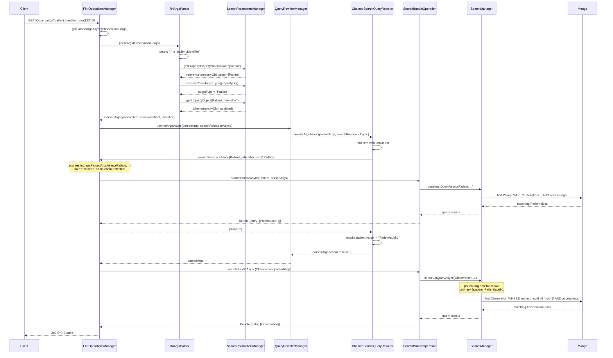

# FHIR Chained Search Parameter Support — Design

## Background

FHIR search supports "chained" reference parameters: instead of filtering the searched resource
directly, a chain filters it by a property of the resource its reference points to.

```
GET [base]/Observation?patient.identifier=http://example.com/fhir/identifier/mrn|123456
GET [base]/Observation?subject:Patient.identifier=http://example.com/fhir/identifier/mrn|123456
```

Both forms mean: find `Observation`s whose `patient`/`subject` reference points to a `Patient`
that has the given `identifier`.

This server does not currently support this, and does so silently in lenient mode:

- `R4ArgsParser.parseArgs` (`src/operations/query/r4ArgsParser.js:96`) splits an arg name only on
  `:` (for modifiers). A `.` in the name is never inspected.
- `SearchParametersManager.getPropertyObject` (`src/searchParameters/searchParametersManager.js:85-111`)
  does a flat `hasOwnProperty` lookup of the arg name against the resource's known search-parameter
  map. `patient.identifier` never matches any key there.
- Net effect: in lenient mode (the default for most REST/GraphQL/MCP calls), the parameter is
  silently dropped and the search runs unfiltered on that criterion. In `STRICT_SEARCH_HANDLING`
  mode it 400s as an unrecognized parameter. Neither behavior is a working chain.

There is no existing chained-search implementation anywhere in this codebase. The closest existing
pattern — `PatientProxyQueryRewriter` + `PersonToPatientIdsExpander`
(`src/utils/personToPatientIdsExpander.js`) — solves an adjacent but narrower problem (resolving the
`Patient/person.<id>` proxy convention to real `Patient` ids) and is discussed below as prior art,
not as something this feature calls into.

## Scope

**In scope**: single-level reference chaining, both the untyped (`patient.identifier`) and typed
(`subject:Patient.identifier`) forms, for any resource type and any reference search parameter
whose target-side parameter is one of the filter types this codebase's query builder (`r4.js`)
already knows how to build (token, string, date, reference, quantity, etc.).

**Out of scope** (explicitly, not by oversight):

- **Nested/multi-level chains** (e.g. `patient.organization.name=...` — a second hop). This would
  require the sub-search resolution to recurse, which is a materially larger and separately
  reviewable change. Revisit as a follow-on if a real caller needs it.
- **Reverse chaining (`_has`)** — finds resources by a property of *other* resources that reference
  them, the opposite direction of `.` chaining. Different query shape, different rewriter, no shared
  implementation with this feature.
- Both REST and GraphQL get this feature simultaneously with no GraphQL-specific work:
  `src/graphql/dataSource.js` and `src/graphqlv2/dataSource.js` both call the same
  `R4ArgsParser.parseArgs` (confirmed via grep — both `require` and inject `R4ArgsParser` and call
  `.parseArgs(...)` at `graphql/dataSource.js:726/756` and `graphqlv2/dataSource.js:756`), so a fix in
  the shared parser/rewriter layer benefits all callers automatically, matching this codebase's
  established convention (see the composite-search-params design for the same principle).

## Security constraint (governs the whole design)

This repo's `review.md` §E ("Cross-tenant joins on a shared identifier") applies directly: chained
search *is* a cross-tenant join on a shared identifier. Two tenants can legitimately share the same
real-world `Patient` at a health system; the sub-search that resolves `Patient` ids from
`identifier=...` must not let one tenant's chained search leak the existence, ids, or metadata of
another tenant's matching `Patient` — the join must carry the caller's tenant/access discriminator
in the join condition itself, not as an afterthought filter.

Concretely: the sub-search that resolves the target resource ids **must** run through this
codebase's real, existing tenant-scoping composition (security tags, patient-scope, data-sharing) —
never a raw `DatabaseQueryFactory` query against the target collection with scoping bolted on
separately per caller type. The existing `PersonToPatientIdsExpander` — the one place in this
codebase that already does something structurally similar — hand-rolls that scoping per call
(`personToPatientIdsExpander.js:392-409`), and its own comments (`:396-408`) document a real,
still-open gap for pure patient-scope tokens found only after the fact. Chaining is a strictly
harder version of that problem, because the target resource type is caller-controlled (any
`:Type.param` chain can name any resource type), so a hand-rolled scoping branch would need to be
independently correct for every possible target type — infeasible to audit by inspection. This
design avoids that failure mode structurally rather than by convention (see "How the join stays
tenant-safe" below).

## A DI constraint that shapes the design

`createContainer.js` was checked directly (not assumed): `queryRewriterManager`
(`createContainer.js:483-496`) constructs its rewriter list synchronously, and **both**
`searchManager` (`:507-516`) and `fhirOperationsManager` (`:1044-1065`) declare `queryRewriterManager`
as a constructor dependency. A new rewriter that itself takes `searchManager` or
`fhirOperationsManager` as a *constructor* dependency creates a real cycle:
`queryRewriterManager → chainedSearchQueryRewriter → searchManager → queryRewriterManager`.

This is exactly why the existing precedent, `PatientProxyQueryRewriter`
(`createContainer.js:489-493`), is constructed with the narrow `personToPatientIdsExpander` and never
with `searchManager`.

**Resolution chosen**: pass the canonical search capability as a **call-time parameter**, not a
constructor dependency. `fhirOperationsManager.js:327-331` already calls
`queryRewriterManager.rewriteArgsAsync(...)` at request time — long after the container has finished
wiring — so there is no cycle in passing a bound reference through that call. This reuses the actual
canonical, already-scoped search implementation (no duplicated scoping logic to audit separately)
while avoiding the DI cycle entirely.

Two other options were considered and rejected for this iteration:
- Mirror `PersonToPatientIdsExpander`'s approach (compose scoping from low-level primitives
  directly in the new rewriter) — avoids the cycle, matches an existing pattern, but duplicates
  tenant-scoping logic in a second place, which is exactly the risk `review.md` §A warns about and
  which `PersonToPatientIdsExpander`'s own history shows is easy to get subtly wrong.
- Extract a shared scoping method out of `SearchManager.constructQueryAsync` that both it and the
  new rewriter call — a genuine single source of truth, but a larger refactor of a heavily-used,
  well-established class than this feature warrants on its own.

## How the join stays tenant-safe

1. `fhirOperationsManager.js:327-331`'s call to `queryRewriterManager.rewriteArgsAsync(...)` gains
   one additional parameter: a bound async function capable of running a fully-scoped search for an
   arbitrary `resourceType`/args combination, using the *current request's* `requestInfo` — call it
   `searchResourceAsync`. `QueryRewriterManager.rewriteArgsAsync` (`queryRewriterManager.js:73-88`)
   forwards it unchanged to each `QueryRewriter.rewriteArgsAsync` call; rewriters that don't need it
   (the existing `ReferenceQueryRewriter`, `PatientProxyQueryRewriter`) simply ignore the extra
   parameter.
2. `ChainedSearchQueryRewriter.rewriteArgsAsync` uses `searchResourceAsync` to run
   `<targetType>?<targetParam>=<value>` — through the same code paths (`searchManager`,
   `securityTagManager`, `patientScopeManager`, `dataSharingManager`) any top-level search for that
   resource type would use, with the *same* `requestInfo`/scope already on the current request. This
   is what keeps the tenant discriminator inside the join rather than bolted on after.
3. Only `{ _uuid: 1, _id: 0 }` is projected back (mirroring `personToPatientIdsExpander.js:355`'s
   existing convention of never fetching more than the id field for this kind of resolution step).
4. If zero ids resolve, the rewriter must produce a filter that can never match anything (e.g. an
   `_uuid` value guaranteed absent) — **never** treat "no matches" as "no filter." (`review.md` §D:
   collapsing "no restriction" and "no matches" into the same representation is a classic way to
   fail open by accident.) This needs an explicit test.

## Parsing: detecting and validating the chain

In `r4ArgsParser.js`'s per-arg loop (currently `:95-96` and the `getPropertyObject` call at
`:117-122`):

1. Detect the chain shape in `argName`: bare (`patient.identifier` — split on `.`) or typed
   (`subject:Patient.identifier` — the existing `:`-split already isolates `Patient.identifier` as a
   modifier; split *that* on `.`).
2. Resolve `propertyObj` for the **base reference param only** (`patient`/`subject`), via the
   existing `getPropertyObject({ resourceType, queryParameter })` call — unchanged from non-chained
   search. `propertyObj.type` stays `'reference'`; `propertyObj.target` gives the legal target
   type(s).
3. Resolve `targetType`:
   - Typed form: must be a member of `propertyObj.target`; 400 otherwise (same treatment as an
     unknown parameter today).
   - Untyped form: only unambiguous if `propertyObj.target` has exactly one entry. If it has more
     than one (e.g. `Observation.performer` targets six resource types), 400 — per spec, an
     ambiguous untyped chain must be rejected, not guessed.
4. Validate `targetParam` is a real search parameter on `targetType` via a second
   `getPropertyObject({ resourceType: targetType, queryParameter: targetParam })` call — same
   function, different resourceType argument. 400 if unknown.
5. Attach `{ targetType, targetParam }` as a new `chain` field on the resulting `ParsedArgsItem`,
   alongside the unchanged `propertyObj`. `queryParameterValue` is left as the raw value for now —
   the rewriter resolves it.

No changes to `src/searchParameters/searchParameters.js` (generated; both lookups reuse existing
entries) or to `searchParametersManager.getPropertyObject` itself — only a small new validation
helper alongside it (e.g. `getReferenceTargetTypes`) for step 3/4's checks.

## The rewriter: resolving and rewriting

New file: `src/queryRewriters/rewriters/chainedSearchQueryRewriter.js`, implementing the existing
`QueryRewriter` interface. Registered in `createContainer.js` next to `ReferenceQueryRewriter`
(`:483-496`) — no constructor dependencies beyond what any other rewriter already takes; the search
capability arrives as a parameter to `rewriteArgsAsync`, not through the constructor (see DI section
above).

For each `ParsedArgsItem` carrying a `chain` field:

1. Call `searchResourceAsync({ resourceType: targetType, args: { [targetParam]: value }, requestInfo })`.
2. Collect resolved `_uuid`s.
3. Rewrite `queryParameterValue` to `<targetType>/<uuid>` reference values (or the unmatchable-filter
   case from "How the join stays tenant-safe" step 4 if none resolve).

After this rewrite, the item is indistinguishable from an ordinary `?patient=Patient/<uuid>` search.
`r4.js`'s filter-type dispatch (`:222-256`) and `FilterByReference`
(`src/operations/query/filters/reference.js:41-146`) need **zero** changes — they consume
`propertyObj.type === 'reference'` and a list of reference values exactly as they do today.

## Multiple chained parameters in one request

- **Different chained params** (e.g. `patient.identifier=A&performer:Practitioner.identifier=B` on
  `Observation`): each gets its own independent `chain` descriptor and its own sub-search. The
  rewriter runs all of them concurrently (`Promise.all`), not sequentially — N chains should not
  stack N× latency. Downstream combination needs no new logic: `r4.js` already `$and`s filters
  across multiple `parsedArgItems`, so once each chain is rewritten to ordinary reference values,
  correct AND semantics (Observation must match all chained criteria) falls out for free.
- **Repeated same-name param** (FHIR AND semantics): each instance resolves its own uuid set
  independently; the resulting `$and` across `_uuid $in setA` / `_uuid $in setB` on the same field
  only matches if a document's single reference happens to land in both sets — narrow but
  spec-correct; needs an explicit test rather than special-cased rejection.
- **Comma-separated value on one param** (FHIR OR semantics): must be a single batched sub-search
  (`Patient?identifier=A,B`, one round trip, union of matches) — not split into per-value
  sub-searches and merged by the rewriter.

## Sequence diagram

`GET /Observation?patient.identifier=http://example.com/fhir/identifier/mrn|123456`:



Two separate round trips to Mongo happen (Patient, then Observation). The "recursion" is
`searchResourceForChainAsync` calling back into the same `getParsedArgsAsync`/`searchBundleAsync`
pair the outer request used, just targeting `Patient` with no chain in its own args — so it
terminates after one extra hop rather than looping.

## Files touched

| File | Change |
|---|---|
| `src/operations/query/r4ArgsParser.js` | Detect chain shape, resolve/validate `targetType`/`targetParam`, attach `chain` to `ParsedArgsItem` |
| `src/searchParameters/searchParametersManager.js` | New validation helper for target type/param, reusing `getPropertyObject` |
| `src/queryRewriters/queryRewriterManager.js` | `rewriteArgsAsync` gains and forwards a `searchResourceAsync` parameter |
| `src/operations/fhirOperationsManager.js` | Pass a bound `searchResourceAsync` into the existing `queryRewriterManager.rewriteArgsAsync(...)` call (`:327-331`) |
| `src/createContainer.js` | Register `chainedSearchQueryRewriter` next to `referenceQueryRewriter` |
| `src/queryRewriters/rewriters/chainedSearchQueryRewriter.js` (new) | The rewriter itself |

Not touched: `src/searchParameters/searchParameters.js` (generated), `src/operations/query/r4.js`,
`src/operations/query/filters/reference.js`, `src/graphql/dataSource.js`,
`src/graphqlv2/dataSource.js`.

## Testing

- Parser unit tests: chain descriptor extraction (bare + typed forms), ambiguous untyped multi-target
  rejection, unknown target param rejection. Model on the existing `r4ArgsParser` unit test file.
- Rewriter unit tests: sub-search invocation shape, empty-resolution → unmatchable filter (not "no
  filter"), concurrent resolution of multiple chains in one request.
- **Cross-tenant regression test (required by `review.md` §E, not optional)**: two tenants each
  owning a `Patient` with the same `identifier` value; confirm tenant A's chained search never
  surfaces, or leaks the existence of, tenant B's matching `Patient`. Model on
  `src/tests/unit/operations/query/searchQuery.crossTenant.test.js`.
- End-to-end integration test: real `?patient.identifier=...` and `?subject:Patient.identifier=...`
  requests against a couple of resource types, via `src/tests/operations/query/r4/r4.reference.test.js`
  or a new sibling file.
- This PR's diff must be reviewed against `review.md` before merge per this repo's
  `CLAUDE.md` ("Security-Sensitive Changes" — any cross-resource join on a shared identifier).

## Effort estimate

Roughly 9-10 engineer-days for REST+GraphQL (GraphQL inherits automatically), single engineer
already familiar with this codebase, assuming no major surprises beyond what's already resolved
above. Risks that could push it higher: product wants nested chains or `_has` in the same pass (out
of scope here, and meaningfully larger on their own), or the adversarial `review.md` review surfaces
a real gap requiring a design change rather than a test fix.
