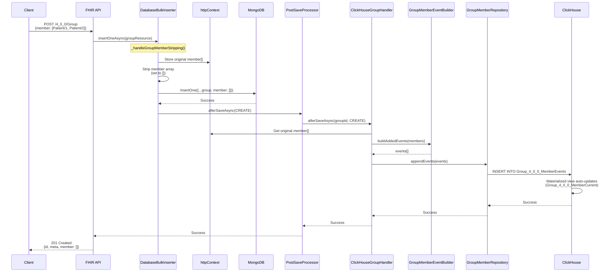
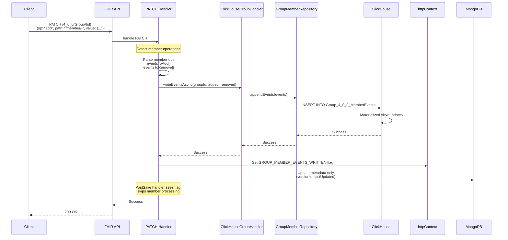
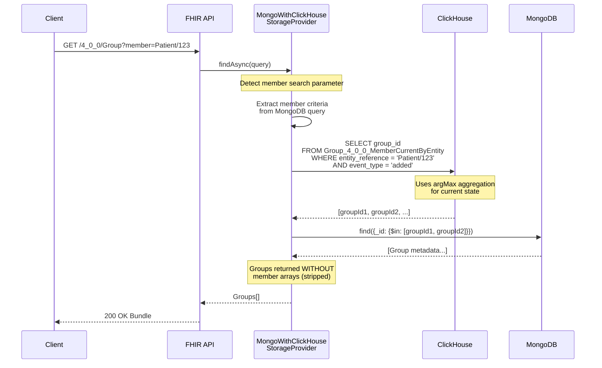

# ClickHouse Integration

## Overview

The FHIR server integrates ClickHouse as a complementary storage backend for resources requiring scalable array storage and event-sourced audit trails. ClickHouse is a columnar analytical database optimized for high-volume, append-heavy workloads with fast analytical queries.

The integration uses a dual-storage model: MongoDB stores resource metadata (transactional CRUD), while ClickHouse stores high-volume data as an event-sourced log. This architecture enables FHIR Groups with millions of members while maintaining sub-second query performance.

**Currently Supported:** Group resources with 1M+ member scale

## Why ClickHouse for Groups

MongoDB's 16MB BSON document limit restricts Group resources to approximately 50K-100K members. ClickHouse solves this by:

- **Event-sourced storage**: Member changes stored as append-only events, not embedded arrays
- **Columnar performance**: Fast member queries using materialized views and argMax aggregation
- **Unlimited scale**: Tested with 1M+ members per Group
- **Complete audit trail**: Every membership change preserved with provenance

## Quick Start

### Configuration

```bash
# Enable ClickHouse
ENABLE_CLICKHOUSE=1

# Configure which resources use ClickHouse
MONGO_WITH_CLICKHOUSE_RESOURCES=Group

# ClickHouse connection
CLICKHOUSE_HOST=127.0.0.1
CLICKHOUSE_PORT=8123
CLICKHOUSE_DATABASE=fhir
CLICKHOUSE_USERNAME=default
CLICKHOUSE_PASSWORD=
```

### Header-Based Activation

ClickHouse member tracking is activated per-request using the `useExternalMemberStorage` header:

```bash
# With header: ClickHouse events are written alongside MongoDB
curl -H "useExternalMemberStorage: true" -X POST /4_0_0/Group ...

# Without header: Standard FHIR behavior (MongoDB only)
curl -X POST /4_0_0/Group ...
```

This allows gradual rollout: existing clients continue using standard FHIR behavior, while ClickHouse-aware clients opt in via the header.

### Docker Setup

ClickHouse is included in `docker-compose.yml`:

```yaml
clickhouse:
  image: clickhouse/clickhouse-server:24.8
  ports:
    - '8123:8123'   # HTTP
    - '9000:9000'   # Native TCP
  volumes:
    - clickhouse_data:/var/lib/clickhouse
    - ./clickhouse-init:/docker-entrypoint-initdb.d
```

Start with: `make up`

Schema initialization runs all SQL files in `clickhouse-init/` in alphabetical order.

## Group API Usage

All standard FHIR operations work with the `useExternalMemberStorage: true` header to enable ClickHouse member tracking. Without the header, standard FHIR behavior applies.

### Creating Groups

Create a Group with initial members using POST:

```bash
POST /4_0_0/Group
Content-Type: application/fhir+json

{
  "resourceType": "Group",
  "type": "person",
  "actual": true,
  "name": "My Patient Cohort",
  "member": [
    { "entity": { "reference": "Patient/1" } },
    { "entity": { "reference": "Patient/2" } },
    { "entity": { "reference": "Patient/3" } }
  ]
}
```

Response: `201 Created` with Group metadata. When the `useExternalMemberStorage` header is set, the `member` field is removed from the stored document (member data tracked in ClickHouse).

### Incremental Loading with PATCH (Recommended)

**For large Groups (50K+ members), use PATCH to add members incrementally.** This is the most efficient pattern:

```bash
# Step 1: Create Group with initial batch (5K-10K members)
POST /4_0_0/Group
{
  "resourceType": "Group",
  "id": "cohort-2025",
  "type": "person",
  "actual": true,
  "member": [
    { "entity": { "reference": "Patient/1" } },
    ...
    { "entity": { "reference": "Patient/5000" } }
  ]
}

# Step 2-N: Add more members using PATCH (5K per batch)
PATCH /4_0_0/Group/cohort-2025
Content-Type: application/json-patch+json

[
  { "op": "add", "path": "/member/-", "value": { "entity": { "reference": "Patient/5001" } } },
  { "op": "add", "path": "/member/-", "value": { "entity": { "reference": "Patient/5002" } } },
  ...
  { "op": "add", "path": "/member/-", "value": { "entity": { "reference": "Patient/10000" } } }
]
```

**Why PATCH is recommended:**
- **Efficient**: Only sends new members, not entire array
- **Scalable**: No request size limit (10K operation limit per PATCH, configurable)
- **Fast**: Direct event writes without reading existing state
- **Network-friendly**: Smaller payloads (KB vs MB)

**Batch size recommendations:**
- 1K-5K operations: Standard workloads
- 5K-10K operations: Bulk imports (default limit: 10K)

### Incremental Loading with PUT (Alternative)

You can also use PUT, where the server computes the diff automatically:

```bash
# Step 1: Create with initial batch
POST /4_0_0/Group { "member": [ /* 10K members */ ] }

# Step 2: Update with full array (server detects additions)
PUT /4_0_0/Group/{id}
{
  "resourceType": "Group",
  "id": "cohort-2025",
  "type": "person",
  "actual": true,
  "member": [
    /* Include ALL previous members + new ones (20K total) */
  ]
}
```

**Limitations of PUT:**
- HTTP payload size limits (typically 6-10MB)
- Maximum ~50K members per PUT (configurable via `MAX_GROUP_MEMBERS_PER_PUT`)
- Larger payloads over network

**ClickHouse optimization:** The server only writes events for net changes (additions/removals), not duplicates.

### Searching by Member

Find all Groups containing a specific patient:

```bash
# Search by sourceId (reference without owner)
GET /4_0_0/Group?member=Patient/123

# Search by UUID (reference with owner, resolved to UUIDv5)
GET /4_0_0/Group?member=Patient/123|client1
```

Searches use enriched ClickHouse columns (`entity_reference_uuid`, `entity_reference_source_id`) set by the `referenceGlobalIdHandler` pre-save handler.

**Performance:** Sub-100ms for member lookup across all Groups (uses indexed materialized view)

### Reading Groups

```bash
GET /4_0_0/Group/{id}
```

Returns the Group resource. When created with the `useExternalMemberStorage` header, the `member` field will not be present (members tracked in ClickHouse). Groups created without the header retain their `member` array in MongoDB.

### Removing Members

Use PATCH to remove specific members:

```bash
PATCH /4_0_0/Group/{id}
Content-Type: application/json-patch+json

[
  {
    "op": "remove",
    "path": "/member",
    "value": { "entity": { "reference": "Patient/123" } }
  }
]
```

Or use PUT with the reduced member array (server detects removals automatically).

## How It Works

### Event-Sourced Architecture

Instead of storing members as an embedded array, ClickHouse tracks membership as immutable events:

```
Event Log                              Current State (Derived)
─────────────────────                  ───────────────────────
event_type='added': Patient/1 @ 10:00  → Patient/1: active
event_type='added': Patient/2 @ 10:05  → Patient/2: active
event_type='removed': Patient/1 @ 10:10 → Patient/1: removed
event_type='added': Patient/1 @ 10:15  → Patient/1: active
```

Every membership change creates an event. Current state is derived using ClickHouse's `argMax` aggregation over the event log.

### Dual Storage Model (when `useExternalMemberStorage` header is present)

**MongoDB stores:**
- Group resource metadata (id, name, type, actual, meta)
- `member` field removed for CREATE, PUT, and `$merge` (smartMerge=false)
- `member` field preserved for PATCH and `$merge` (smartMerge=true, the default)

**ClickHouse stores:**
- Member events (`Group_4_0_0_MemberEvents` table)
- Materialized current state (`Group_4_0_0_MemberCurrent` table)
- Reverse lookup index (`Group_4_0_0_MemberCurrentByEntity` table)

**Write behavior by operation:**

| Operation | MongoDB members | ClickHouse events |
|-----------|----------------|-------------------|
| CREATE | `member` field removed | MEMBER_ADDED for all |
| PATCH | Preserved (unchanged) | Events from PATCH ops only |
| PUT | `member` field removed | Diff: adds + removes |
| $merge (smartMerge=true) | Preserved (unchanged) | Adds only, no removals |
| $merge (smartMerge=false) | `member` field removed | Diff: adds + removes |
| DELETE | Removed from MongoDB | Events retained for audit |

**Query routing:**
- Member queries (`?member=Patient/X`) → ClickHouse → MongoDB (for full Group resources)
- Metadata queries (`?name=MyGroup`) → MongoDB
- GET by ID → MongoDB

### ClickHouse Schema

**Event Log** (`Group_4_0_0_MemberEvents`):
```sql
CREATE TABLE fhir.Group_4_0_0_MemberEvents (
    group_id String,
    entity_reference String,
    entity_reference_uuid String DEFAULT '',
    entity_reference_source_id String DEFAULT '',
    entity_type LowCardinality(String),
    event_type Enum8('added' = 1, 'removed' = 2),
    event_time DateTime64(3, 'UTC'),
    event_id UUID,  -- Tie-breaker for deterministic ordering
    period_start Nullable(DateTime64(3, 'UTC')),
    period_end Nullable(DateTime64(3, 'UTC')),
    inactive UInt8,
    actor String,
    reason LowCardinality(String),
    correlation_id String,
    access_tags Array(String),
    owner_tags Array(String),
    source_assigning_authority LowCardinality(String)
) ENGINE = MergeTree()
ORDER BY (group_id, entity_reference, event_time, event_id);
```

**Current State** (`Group_4_0_0_MemberCurrent`):
- Materialized view using `AggregatingMergeTree`
- One row per (group_id, entity_reference) after merges
- Uses `argMax(field, (event_time, event_id))` for latest state
- Auto-updates on every INSERT to event log

**Reverse Lookup** (`Group_4_0_0_MemberCurrentByEntity`):
- Ordered by (entity_reference, group_id)
- Powers "which groups is Patient X in?" queries
- Lightweight index for fast lookups

## Architecture Diagrams

### POST/PUT Flow (Create or Update Group)



### PATCH Flow (Incremental Member Addition)



### Search by Member Flow



## Performance

**Scale:**
- Supports 1M+ members per Group
- No practical upper limit (tested to 1M in performance tests)

**Query Performance:**
- Member search: <100ms (sub-second across all Groups)
- Member count: <50ms
- Reverse lookup: <50ms (which Groups contain Patient X)

**Write Performance:**
- PATCH (10K operations): ~1-2 seconds
- POST (10K members): ~1-2 seconds
- PUT with diff computation: ~2-3 seconds

**Throughput:**
- Tested: 50K members loaded incrementally in ~60 seconds
- Real-world: Depends on network, payload size, and server resources

## Querying ClickHouse Directly

For debugging or advanced analytics, you can query ClickHouse directly:

```sql
-- Connect to ClickHouse
docker exec -it fhir-clickhouse clickhouse-client

-- Count active members in a Group
SELECT count() as count
FROM (
    SELECT entity_reference
    FROM fhir.Group_4_0_0_MemberEvents
    WHERE group_id = 'my-group-id'
    GROUP BY entity_reference
    HAVING argMax(event_type, (event_time, event_id)) = 'added'
       AND argMax(inactive, (event_time, event_id)) = 0
);

-- List active members (paginated)
SELECT entity_reference, entity_type
FROM fhir.Group_4_0_0_MemberEvents
WHERE group_id = 'my-group-id'
GROUP BY entity_reference, entity_type
HAVING argMax(event_type, (event_time, event_id)) = 'added'
   AND argMax(inactive, (event_time, event_id)) = 0
ORDER BY entity_reference
LIMIT 100;

-- Find Groups containing a member (reverse lookup)
SELECT group_id
FROM fhir.Group_4_0_0_MemberEvents
WHERE entity_reference = 'Patient/123'
GROUP BY group_id
HAVING argMax(event_type, (event_time, event_id)) = 'added'
   AND argMax(inactive, (event_time, event_id)) = 0;

-- View complete event history for a member
SELECT
    event_type,
    event_time,
    entity_reference,
    actor,
    reason,
    correlation_id
FROM fhir.Group_4_0_0_MemberEvents
WHERE group_id = 'my-group-id'
  AND entity_reference = 'Patient/123'
ORDER BY event_time ASC, event_id ASC;
```

## Other Resources

The ClickHouse integration architecture supports additional FHIR resource types beyond Groups. Resources planned for future implementation include:

- **AuditEvent**: Compliance logging and security audit trails (append-only pattern)
- **Observation**: Device telemetry and high-volume lab results (time-series pattern)

These resources would use the `CLICKHOUSE_ONLY` storage pattern (no MongoDB dual-write). Implementation is driven by user requirements.

## Configuration Reference

### Required Variables

```bash
# Enable ClickHouse integration
ENABLE_CLICKHOUSE=1

# Resources using dual-write pattern (MongoDB + ClickHouse)
MONGO_WITH_CLICKHOUSE_RESOURCES=Group

# ClickHouse server connection
CLICKHOUSE_HOST=127.0.0.1           # Or 'clickhouse' in Docker network
CLICKHOUSE_PORT=8123                # HTTP interface port
CLICKHOUSE_DATABASE=fhir            # Database name
CLICKHOUSE_USERNAME=default         # Default for local dev
CLICKHOUSE_PASSWORD=                # Empty for local dev
```

### Optional Variables

```bash
# Fallback to MongoDB if ClickHouse unavailable (default: false)
CLICKHOUSE_FALLBACK_TO_MONGO=true

# Maximum PATCH operations per request (default: 10000)
GROUP_PATCH_OPERATIONS_LIMIT=10000

# Maximum members per PUT request (default: 50000)
MAX_GROUP_MEMBERS_PER_PUT=50000

# Resources using ClickHouse-only pattern (future)
# CLICKHOUSE_ONLY_RESOURCES=AuditEvent
```

### Storage Patterns

The server supports three storage patterns (configured per resource type):

1. **MONGO** (default): Pure MongoDB storage
   - Used by: Most FHIR resources (Patient, Practitioner, Observation, etc.)

2. **MONGO_WITH_CLICKHOUSE** (dual-write): MongoDB metadata + ClickHouse events
   - Used by: Group
   - MongoDB: Resource metadata
   - ClickHouse: High-volume data (member events)

3. **CLICKHOUSE_ONLY** (append-only): Pure ClickHouse storage
   - Planned for: AuditEvent, Observation (device telemetry)
   - No MongoDB, append-only events

## Security

Group member queries respect FHIR security tags:

```json
{
  "meta": {
    "security": [
      { "system": "https://www.icanbwell.com/access", "code": "client1" },
      { "system": "https://www.icanbwell.com/owner", "code": "client1" }
    ]
  }
}
```

Only Groups with matching `access` or `owner` tags are returned in search results. Security tags are stored in ClickHouse and filtered at query time.

## Troubleshooting

### ClickHouse Connection Errors

**Symptom:** `Error connecting to ClickHouse`

**Solutions:**
1. Verify ClickHouse is running: `docker ps | grep clickhouse`
2. Check logs: `docker logs fhir-clickhouse`
3. Test connection: `docker exec -it fhir-clickhouse clickhouse-client`
4. Verify `CLICKHOUSE_HOST` in configuration (use `127.0.0.1` or container name)

### Schema Initialization Errors

**Symptom:** `Unknown expression or function identifier 'entity_reference_uuid'` during `make up`

**Solutions:**
1. Wipe ClickHouse volume: `docker compose -p fhir-dev down -v && make up`
2. Or run migration manually: `docker exec -i fhir-clickhouse clickhouse-client --multiquery < clickhouse-init/02-add-entity-reference-columns.sql`

The Makefile runs all `clickhouse-init/*.sql` files in alphabetical order. If the volume persists from an older schema, `02-add-entity-reference-columns.sql` applies the migration.

### Groups Not Appearing in Member Search

**Symptom:** `GET /Group?member=Patient/X` returns empty results

**Solutions:**
1. Ensure `useExternalMemberStorage: true` header is present on both write and read requests
2. Check ClickHouse has events:
   ```sql
   SELECT count(*) FROM fhir.Group_4_0_0_MemberEvents WHERE group_id = 'my-group-id';
   ```
3. Verify security tags match between Group and query context
4. Check ClickHouse logs for insert errors

### PATCH Operations Failing

**Symptom:** `400 Bad Request` or `500` on PATCH with member operations

**Solutions:**
1. Verify `Content-Type: application/json-patch+json` header
2. Verify `useExternalMemberStorage: true` header is present
3. Check operation count (default limit: 10K operations)
3. Validate PATCH operation format:
   - Add: `{"op": "add", "path": "/member/-", "value": {"entity": {"reference": "Patient/123"}}}`
   - Remove: `{"op": "remove", "path": "/member", "value": {"entity": {"reference": "Patient/123"}}}`

### Performance Issues

**Symptom:** Slow member queries (>5 seconds)

**Solutions:**
1. Verify materialized views exist:
   ```sql
   SHOW TABLES FROM fhir;
   -- Should see: Group_4_0_0_MemberEvents, Group_4_0_0_MemberCurrent, Group_4_0_0_MemberCurrentByEntity
   ```
2. Check ClickHouse server resources (CPU, memory)
3. Review ClickHouse query logs for slow queries
4. Ensure queries use indexed columns (group_id, entity_reference)

## Health Monitoring

The `/health` endpoint includes ClickHouse status:

```bash
curl http://localhost:3000/health

{
  "mongodb": "ok",
  "clickhouse": "ok",
  "redis": "ok"
}
```

## Related Documentation

- [FHIR Group Resource Specification](https://www.hl7.org/fhir/group.html)
- [Performance Optimization](./performance.md)
- [Security Model](./security.md)

## Support

For issues or questions, please open a GitHub issue:
- GitHub Issues: https://github.com/icanbwell/fhir-server/issues
